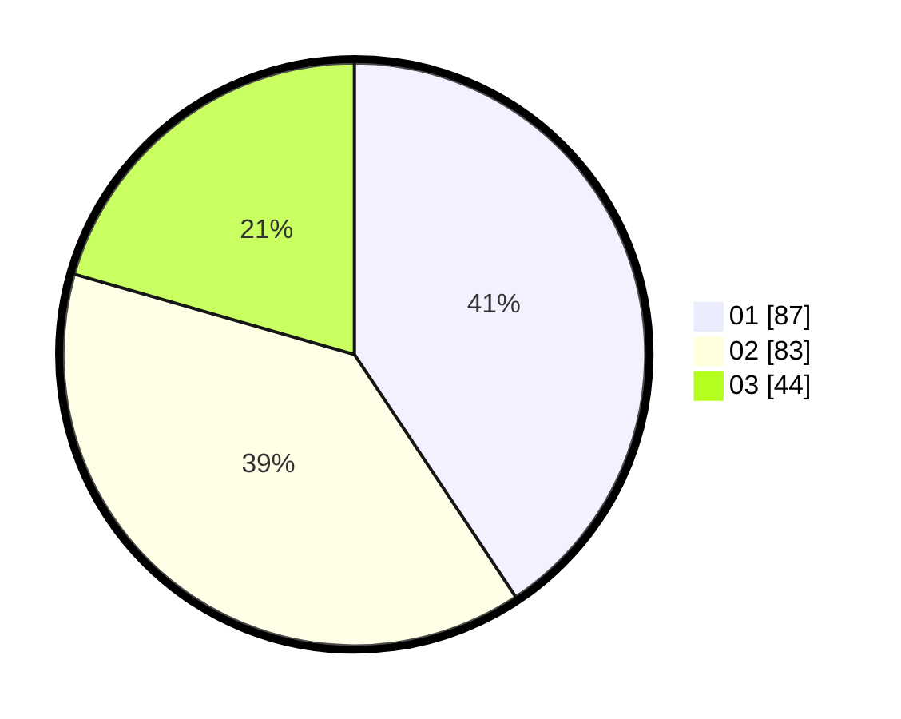

# Hasil

Hasil perolehan suara paslon dapat dilihat pada file paslon-01.txt, paslon-02.txt, dan paslon-03.txt.

Jika tidak ada, artinya data tersebut belum ada pada SIREKAP.

## Perolehan Suara

 * Paslon 01: **87**.
 * Paslon 02: **83**.
 * Paslon 03: **44**.

## Foto C Plano

https://sirekap-obj-formc.kpu.go.id/a374/pemilu/ppwp/31/71/04/10/06/3171041006012-20240214-204218--3c2bbb42-c493-44a0-8d2b-05389d66345b.jpg

https://sirekap-obj-formc.kpu.go.id/a374/pemilu/ppwp/31/71/04/10/06/3171041006012-20240217-133139--85d12958-4e35-4539-954e-5a78b4bbfe26.jpg

https://sirekap-obj-formc.kpu.go.id/a374/pemilu/ppwp/31/71/04/10/06/3171041006012-20240217-132819--7ac1bc65-e40c-4124-8e70-69b19181ae26.jpg

## DATA PEMILIH TETAP

Jumlah pemilih dalam DPT: **290**.
 * L: **142**.
 * P: **148**.

## DATA PENGGUNA HAK PILIH

Jumlah pengguna hak pilih dalam DPT: **213**.
 * L: **100**.
 * P: **113**.

Jumlah pengguna hak pilih dalam DPTb: **0**.
 * L: **0**.
 * P: **0**.

Jumlah pengguna hak pilih dalam DPK: **2**.
 * L: **0**.
 * P: **2**.

Jumlah pengguna hak pilih: **215**.
 * L: **100**.
 * P: **115**.

## JUMLAH SUARA SAH DAN TIDAK SAH

JUMLAH SELURUH SUARA SAH: **214**.

JUMLAH SUARA TIDAK SAH: **1**.

JUMLAH SELURUH SUARA SAH DAN SUARA TIDAK SAH: **215**.
