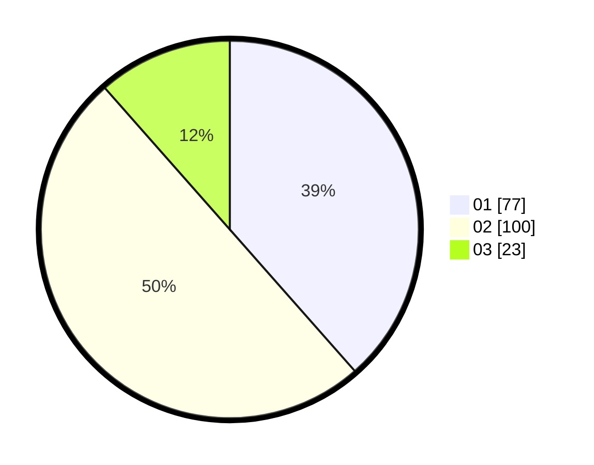

# Hasil

Hasil perolehan suara paslon dapat dilihat pada file paslon-01.txt, paslon-02.txt, dan paslon-03.txt.

Jika tidak ada, artinya data tersebut belum ada pada SIREKAP.

## Perolehan Suara

 * Paslon 01: **77**.
 * Paslon 02: **100**.
 * Paslon 03: **23**.

## Foto C Plano

https://sirekap-obj-formc.kpu.go.id/73d0/pemilu/ppwp/31/71/04/10/06/3171041006013-20240217-153604--45023075-f848-4d30-b0d8-9a3b6122f005.jpg

https://sirekap-obj-formc.kpu.go.id/73d0/pemilu/ppwp/31/71/04/10/06/3171041006013-20240217-153606--2277bc11-f547-4265-b5b4-31e35a269d16.jpg

https://sirekap-obj-formc.kpu.go.id/73d0/pemilu/ppwp/31/71/04/10/06/3171041006013-20240217-153605--696130f5-c4b6-423d-b1d7-de7ce0c66076.jpg

## DATA PEMILIH TETAP

Jumlah pemilih dalam DPT: **279**.
 * L: **149**.
 * P: **130**.

## DATA PENGGUNA HAK PILIH

Jumlah pengguna hak pilih dalam DPT: **200**.
 * L: **99**.
 * P: **101**.

Jumlah pengguna hak pilih dalam DPTb: **1**.
 * L: **1**.
 * P: **0**.

Jumlah pengguna hak pilih dalam DPK: **3**.
 * L: **3**.
 * P: **0**.

Jumlah pengguna hak pilih: **204**.
 * L: **103**.
 * P: **101**.

## JUMLAH SUARA SAH DAN TIDAK SAH

JUMLAH SELURUH SUARA SAH: **200**.

JUMLAH SUARA TIDAK SAH: **4**.

JUMLAH SELURUH SUARA SAH DAN SUARA TIDAK SAH: **204**.
