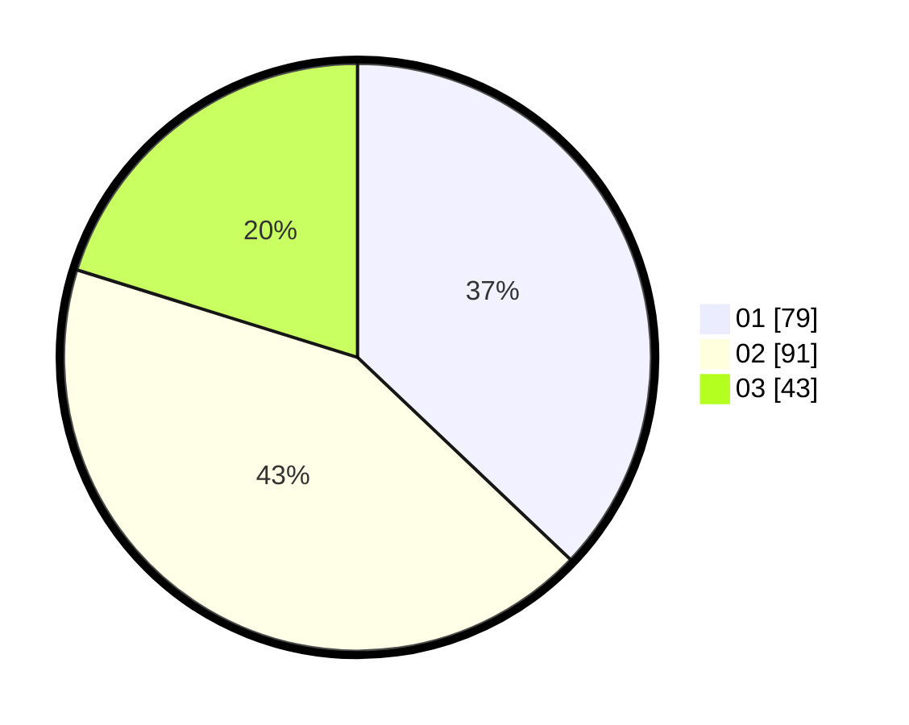

# Hasil

Hasil perolehan suara paslon dapat dilihat pada file paslon-01.txt, paslon-02.txt, dan paslon-03.txt.

Jika tidak ada, artinya data tersebut belum ada pada SIREKAP.

## Perolehan Suara

 * Paslon 01: **79**.
 * Paslon 02: **91**.
 * Paslon 03: **43**.

## Foto C Plano

https://sirekap-obj-formc.kpu.go.id/ceec/pemilu/ppwp/31/71/04/10/06/3171041006014-20240217-172821--2902e7dd-ca4d-49db-af0b-90149bf19905.jpg

https://sirekap-obj-formc.kpu.go.id/ceec/pemilu/ppwp/31/71/04/10/06/3171041006014-20240217-172926--0226497a-f5cf-4d5b-bf75-0d9b8f0ff756.jpg

https://sirekap-obj-formc.kpu.go.id/ceec/pemilu/ppwp/31/71/04/10/06/3171041006014-20240217-173042--3563355e-220b-4a13-8925-4c74dcfabbab.jpg

## DATA PEMILIH TETAP

Jumlah pemilih dalam DPT: **291**.
 * L: **140**.
 * P: **151**.

## DATA PENGGUNA HAK PILIH

Jumlah pengguna hak pilih dalam DPT: **209**.
 * L: **93**.
 * P: **116**.

Jumlah pengguna hak pilih dalam DPTb: **4**.
 * L: **2**.
 * P: **2**.

Jumlah pengguna hak pilih dalam DPK: **2**.
 * L: **1**.
 * P: **1**.

Jumlah pengguna hak pilih: **215**.
 * L: **96**.
 * P: **119**.

## JUMLAH SUARA SAH DAN TIDAK SAH

JUMLAH SELURUH SUARA SAH: **213**.

JUMLAH SUARA TIDAK SAH: **2**.

JUMLAH SELURUH SUARA SAH DAN SUARA TIDAK SAH: **215**.
