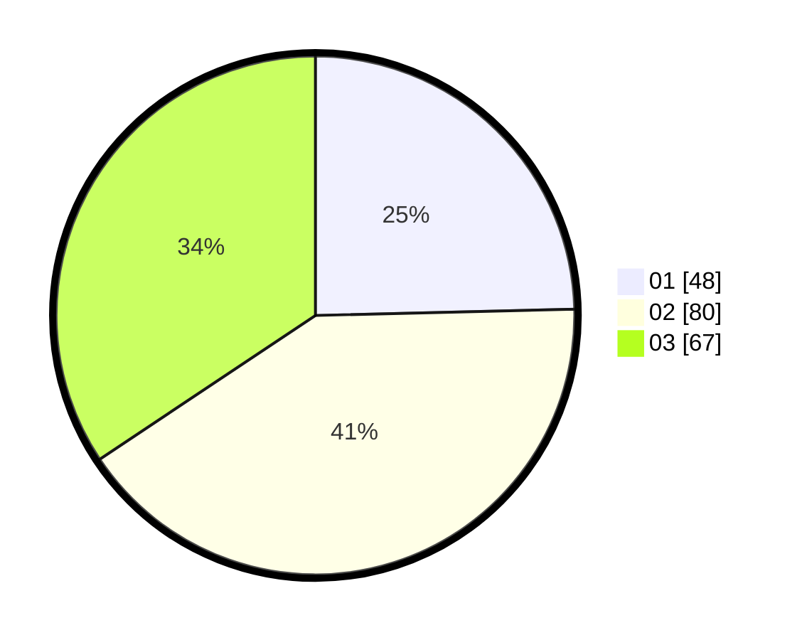

# Hasil

Hasil perolehan suara paslon dapat dilihat pada file paslon-01.txt, paslon-02.txt, dan paslon-03.txt.

Jika tidak ada, artinya data tersebut belum ada pada SIREKAP.

## Perolehan Suara

 * Paslon 01: **48**.
 * Paslon 02: **80**.
 * Paslon 03: **67**.

## Foto C Plano

https://sirekap-obj-formc.kpu.go.id/a187/pemilu/ppwp/31/71/04/10/06/3171041006016-20240217-233953--380601e5-13b3-431b-a550-86724b4e6d7e.jpg

https://sirekap-obj-formc.kpu.go.id/a187/pemilu/ppwp/31/71/04/10/06/3171041006016-20240217-233954--916eae39-d57d-4da6-b62e-921965ca8e56.jpg

https://sirekap-obj-formc.kpu.go.id/a187/pemilu/ppwp/31/71/04/10/06/3171041006016-20240217-233953--315aa533-4431-4ecf-98a0-f072517bcf7a.jpg

## DATA PEMILIH TETAP

Jumlah pemilih dalam DPT: **252**.
 * L: **131**.
 * P: **121**.

## DATA PENGGUNA HAK PILIH

Jumlah pengguna hak pilih dalam DPT: **194**.
 * L: **101**.
 * P: **93**.

Jumlah pengguna hak pilih dalam DPTb: **0**.
 * L: **0**.
 * P: **0**.

Jumlah pengguna hak pilih dalam DPK: **3**.
 * L: **2**.
 * P: **1**.

Jumlah pengguna hak pilih: **197**.
 * L: **103**.
 * P: **94**.

## JUMLAH SUARA SAH DAN TIDAK SAH

JUMLAH SELURUH SUARA SAH: **195**.

JUMLAH SUARA TIDAK SAH: **2**.

JUMLAH SELURUH SUARA SAH DAN SUARA TIDAK SAH: **197**.
