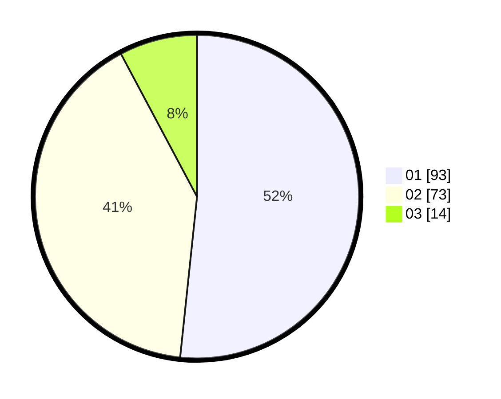

# Hasil

Hasil perolehan suara paslon dapat dilihat pada file paslon-01.txt, paslon-02.txt, dan paslon-03.txt.

Jika tidak ada, artinya data tersebut belum ada pada SIREKAP.

## Perolehan Suara

 * Paslon 01: **93**.
 * Paslon 02: **73**.
 * Paslon 03: **14**.

## Foto C Plano

https://sirekap-obj-formc.kpu.go.id/b866/pemilu/ppwp/31/71/04/10/06/3171041006017-20240217-185945--f337fcf5-fa6e-4763-b67f-659d54b4df49.jpg

https://sirekap-obj-formc.kpu.go.id/b866/pemilu/ppwp/31/71/04/10/06/3171041006017-20240217-190026--8c53a962-1ebb-4d44-9868-7291067fc561.jpg

https://sirekap-obj-formc.kpu.go.id/b866/pemilu/ppwp/31/71/04/10/06/3171041006017-20240217-190102--0ca00c84-0585-4a18-85db-da3248966545.jpg

## DATA PEMILIH TETAP

Jumlah pemilih dalam DPT: **268**.
 * L: **138**.
 * P: **130**.

## DATA PENGGUNA HAK PILIH

Jumlah pengguna hak pilih dalam DPT: **181**.
 * L: **90**.
 * P: **91**.

Jumlah pengguna hak pilih dalam DPTb: **2**.
 * L: **0**.
 * P: **2**.

Jumlah pengguna hak pilih dalam DPK: **0**.
 * L: **0**.
 * P: **0**.

Jumlah pengguna hak pilih: **183**.
 * L: **90**.
 * P: **93**.

## JUMLAH SUARA SAH DAN TIDAK SAH

JUMLAH SELURUH SUARA SAH: **180**.

JUMLAH SUARA TIDAK SAH: **3**.

JUMLAH SELURUH SUARA SAH DAN SUARA TIDAK SAH: **183**.
