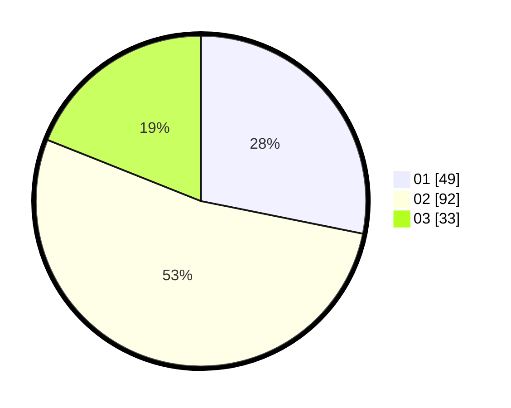

# Hasil

Hasil perolehan suara paslon dapat dilihat pada file paslon-01.txt, paslon-02.txt, dan paslon-03.txt.

Jika tidak ada, artinya data tersebut belum ada pada SIREKAP.

## Perolehan Suara

 * Paslon 01: **49**.
 * Paslon 02: **92**.
 * Paslon 03: **33**.

## Foto C Plano

https://sirekap-obj-formc.kpu.go.id/ef3b/pemilu/ppwp/31/71/04/10/06/3171041006023-20240217-234141--d6a4a0a3-ff63-4fad-aa42-da2793cf483c.jpg

https://sirekap-obj-formc.kpu.go.id/ef3b/pemilu/ppwp/31/71/04/10/06/3171041006023-20240217-234142--032d86b8-2528-4814-86af-9ffb965698f2.jpg

https://sirekap-obj-formc.kpu.go.id/ef3b/pemilu/ppwp/31/71/04/10/06/3171041006023-20240217-234141--d0b7d745-6aba-496f-ae56-d01543775bbc.jpg

## DATA PEMILIH TETAP

Jumlah pemilih dalam DPT: **247**.
 * L: **125**.
 * P: **122**.

## DATA PENGGUNA HAK PILIH

Jumlah pengguna hak pilih dalam DPT: **171**.
 * L: **86**.
 * P: **85**.

Jumlah pengguna hak pilih dalam DPTb: **4**.
 * L: **0**.
 * P: **4**.

Jumlah pengguna hak pilih dalam DPK: **3**.
 * L: **2**.
 * P: **1**.

Jumlah pengguna hak pilih: **178**.
 * L: **88**.
 * P: **90**.

## JUMLAH SUARA SAH DAN TIDAK SAH

JUMLAH SELURUH SUARA SAH: **174**.

JUMLAH SUARA TIDAK SAH: **4**.

JUMLAH SELURUH SUARA SAH DAN SUARA TIDAK SAH: **178**.
