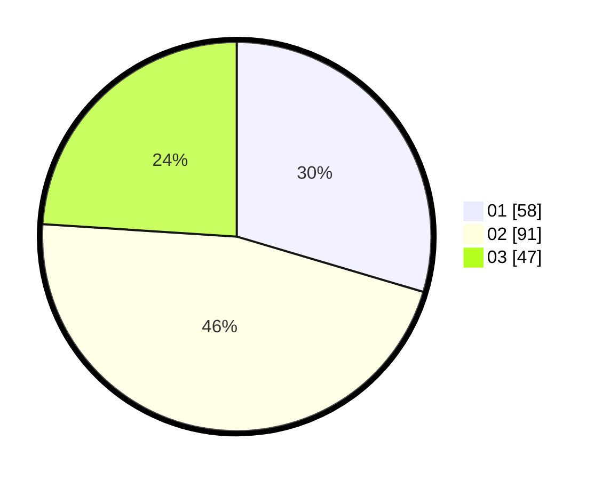

# Hasil

Hasil perolehan suara paslon dapat dilihat pada file paslon-01.txt, paslon-02.txt, dan paslon-03.txt.

Jika tidak ada, artinya data tersebut belum ada pada SIREKAP.

## Perolehan Suara

 * Paslon 01: **58**.
 * Paslon 02: **91**.
 * Paslon 03: **47**.

## Foto C Plano

https://sirekap-obj-formc.kpu.go.id/7745/pemilu/ppwp/31/71/04/10/06/3171041006025-20240217-211142--be575f45-f2e6-44a4-b0f5-5fee3b02df26.jpg

https://sirekap-obj-formc.kpu.go.id/7745/pemilu/ppwp/31/71/04/10/06/3171041006025-20240217-211143--135394e9-fe7a-4cb6-86d5-947d6c802fe0.jpg

https://sirekap-obj-formc.kpu.go.id/7745/pemilu/ppwp/31/71/04/10/06/3171041006025-20240217-211142--f4b4f366-7157-4e61-8ce8-5f1562c2c54e.jpg

## DATA PEMILIH TETAP

Jumlah pemilih dalam DPT: **254**.
 * L: **121**.
 * P: **133**.

## DATA PENGGUNA HAK PILIH

Jumlah pengguna hak pilih dalam DPT: **179**.
 * L: **80**.
 * P: **99**.

Jumlah pengguna hak pilih dalam DPTb: **13**.
 * L: **2**.
 * P: **11**.

Jumlah pengguna hak pilih dalam DPK: **6**.
 * L: **2**.
 * P: **4**.

Jumlah pengguna hak pilih: **198**.
 * L: **84**.
 * P: **114**.

## JUMLAH SUARA SAH DAN TIDAK SAH

JUMLAH SELURUH SUARA SAH: **196**.

JUMLAH SUARA TIDAK SAH: **2**.

JUMLAH SELURUH SUARA SAH DAN SUARA TIDAK SAH: **198**.
