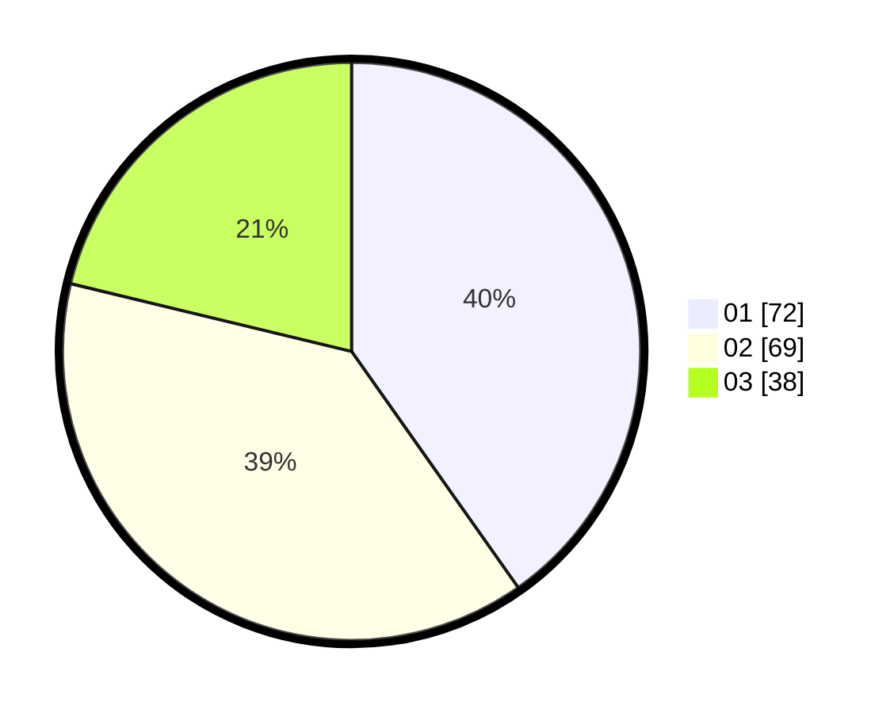

# Hasil

Hasil perolehan suara paslon dapat dilihat pada file paslon-01.txt, paslon-02.txt, dan paslon-03.txt.

Jika tidak ada, artinya data tersebut belum ada pada SIREKAP.

## Perolehan Suara

 * Paslon 01: **72**.
 * Paslon 02: **69**.
 * Paslon 03: **38**.

## Foto C Plano

https://sirekap-obj-formc.kpu.go.id/abfe/pemilu/ppwp/31/71/04/10/06/3171041006030-20240218-172440--d7adf142-6d96-4b00-88d2-a11afb92215a.jpg

https://sirekap-obj-formc.kpu.go.id/abfe/pemilu/ppwp/31/71/04/10/06/3171041006030-20240218-172321--2b520ede-6deb-4596-af16-73f4a798fa2b.jpg

https://sirekap-obj-formc.kpu.go.id/abfe/pemilu/ppwp/31/71/04/10/06/3171041006030-20240218-173035--3cc9c0c5-1b02-4c3f-aace-5bc569921a78.jpg

## DATA PEMILIH TETAP

Jumlah pemilih dalam DPT: **241**.
 * L: **120**.
 * P: **121**.

## DATA PENGGUNA HAK PILIH

Jumlah pengguna hak pilih dalam DPT: **182**.
 * L: **89**.
 * P: **93**.

Jumlah pengguna hak pilih dalam DPTb: **0**.
 * L: **0**.
 * P: **0**.

Jumlah pengguna hak pilih dalam DPK: **1**.
 * L: **0**.
 * P: **1**.

Jumlah pengguna hak pilih: **183**.
 * L: **89**.
 * P: **94**.

## JUMLAH SUARA SAH DAN TIDAK SAH

JUMLAH SELURUH SUARA SAH: **179**.

JUMLAH SUARA TIDAK SAH: **4**.

JUMLAH SELURUH SUARA SAH DAN SUARA TIDAK SAH: **183**.
