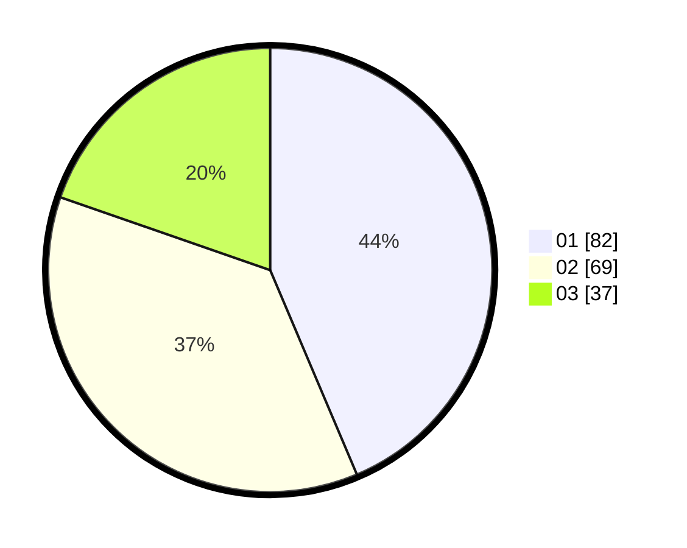

# Hasil

Hasil perolehan suara paslon dapat dilihat pada file paslon-01.txt, paslon-02.txt, dan paslon-03.txt.

Jika tidak ada, artinya data tersebut belum ada pada SIREKAP.

## Perolehan Suara

 * Paslon 01: **82**.
 * Paslon 02: **69**.
 * Paslon 03: **37**.

## Foto C Plano

https://sirekap-obj-formc.kpu.go.id/c264/pemilu/ppwp/31/71/04/10/06/3171041006033-20240217-180211--a1a88468-5c85-41aa-ad5b-1933e8b8c9cd.jpg

https://sirekap-obj-formc.kpu.go.id/c264/pemilu/ppwp/31/71/04/10/06/3171041006033-20240218-134130--56ac9e9a-9e11-4bf7-9499-93ae56326b9e.jpg

https://sirekap-obj-formc.kpu.go.id/c264/pemilu/ppwp/31/71/04/10/06/3171041006033-20240218-134254--c386a63c-bb5d-4262-8fab-adcfbfe57169.jpg

## DATA PEMILIH TETAP

Jumlah pemilih dalam DPT: **249**.
 * L: **132**.
 * P: **117**.

## DATA PENGGUNA HAK PILIH

Jumlah pengguna hak pilih dalam DPT: **189**.
 * L: **96**.
 * P: **93**.

Jumlah pengguna hak pilih dalam DPTb: **0**.
 * L: **0**.
 * P: **0**.

Jumlah pengguna hak pilih dalam DPK: **4**.
 * L: **4**.
 * P: **0**.

Jumlah pengguna hak pilih: **193**.
 * L: **100**.
 * P: **93**.

## JUMLAH SUARA SAH DAN TIDAK SAH

JUMLAH SELURUH SUARA SAH: **188**.

JUMLAH SUARA TIDAK SAH: **5**.

JUMLAH SELURUH SUARA SAH DAN SUARA TIDAK SAH: **193**.
