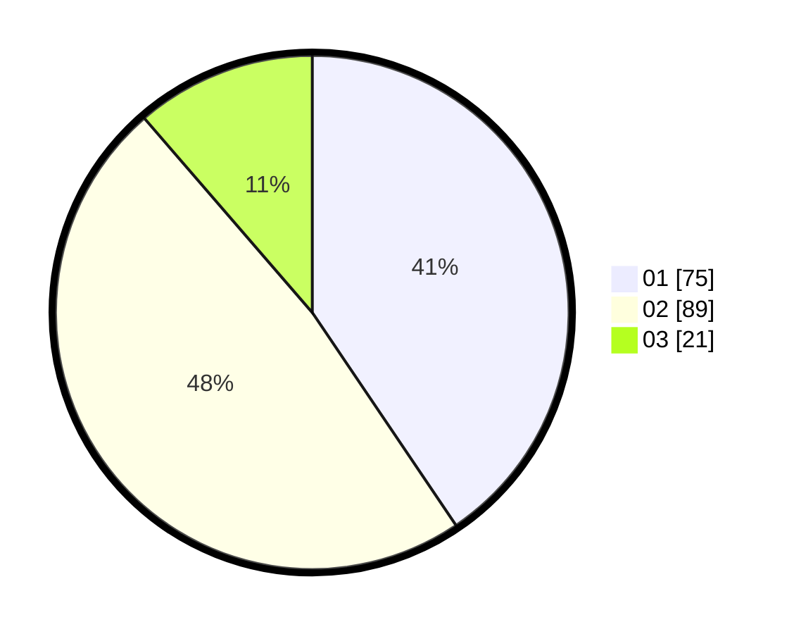

# Hasil

Hasil perolehan suara paslon dapat dilihat pada file paslon-01.txt, paslon-02.txt, dan paslon-03.txt.

Jika tidak ada, artinya data tersebut belum ada pada SIREKAP.

## Perolehan Suara

 * Paslon 01: **75**.
 * Paslon 02: **89**.
 * Paslon 03: **21**.

## Foto C Plano

https://sirekap-obj-formc.kpu.go.id/a696/pemilu/ppwp/31/71/04/10/06/3171041006039-20240217-195424--535c3776-2857-466f-883b-6714de02ce6c.jpg

https://sirekap-obj-formc.kpu.go.id/a696/pemilu/ppwp/31/71/04/10/06/3171041006039-20240217-195513--17e44e76-1b77-4abd-9077-b8ed491a7ab6.jpg

https://sirekap-obj-formc.kpu.go.id/a696/pemilu/ppwp/31/71/04/10/06/3171041006039-20240217-195639--46f30682-e216-4a23-bd10-9ded9e66d46f.jpg

## DATA PEMILIH TETAP

Jumlah pemilih dalam DPT: **260**.
 * L: **148**.
 * P: **112**.

## DATA PENGGUNA HAK PILIH

Jumlah pengguna hak pilih dalam DPT: **260**.
 * L: **148**.
 * P: **112**.

Jumlah pengguna hak pilih dalam DPTb: **260**.
 * L: **148**.
 * P: **112**.

Jumlah pengguna hak pilih dalam DPK: **0**.
 * L: **0**.
 * P: **0**.

Jumlah pengguna hak pilih: **261**.
 * L: **148**.
 * P: **113**.

## JUMLAH SUARA SAH DAN TIDAK SAH

JUMLAH SELURUH SUARA SAH: **185**.

JUMLAH SUARA TIDAK SAH: **3**.

JUMLAH SELURUH SUARA SAH DAN SUARA TIDAK SAH: **188**.
