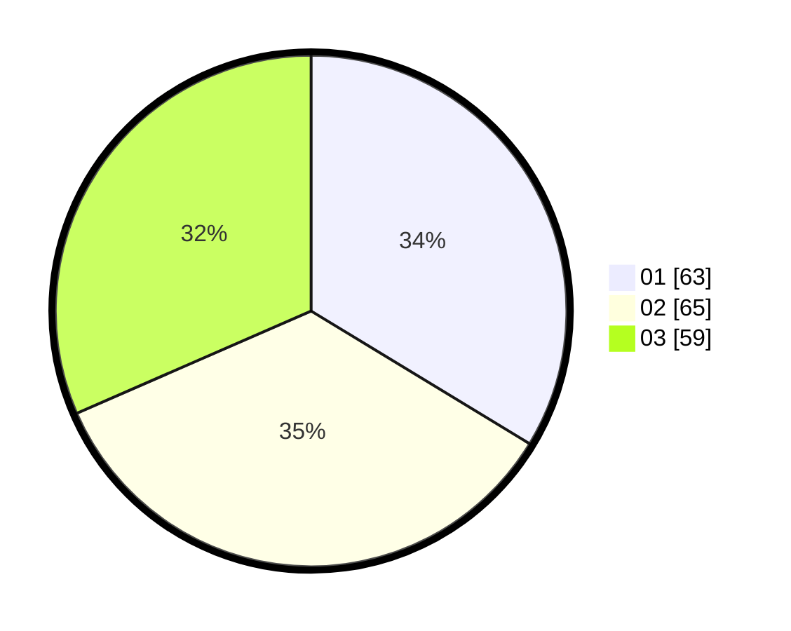

# Hasil

Hasil perolehan suara paslon dapat dilihat pada file paslon-01.txt, paslon-02.txt, dan paslon-03.txt.

Jika tidak ada, artinya data tersebut belum ada pada SIREKAP.

## Perolehan Suara

 * Paslon 01: **63**.
 * Paslon 02: **65**.
 * Paslon 03: **59**.

## Foto C Plano

https://sirekap-obj-formc.kpu.go.id/78ea/pemilu/ppwp/31/71/04/10/06/3171041006043-20240214-213622--8eeec78b-64db-4009-ac15-59b4af74c6d9.jpg

https://sirekap-obj-formc.kpu.go.id/78ea/pemilu/ppwp/31/71/04/10/06/3171041006043-20240214-213636--c2e6347b-d2f5-4be1-8575-bee05aa1f982.jpg

https://sirekap-obj-formc.kpu.go.id/78ea/pemilu/ppwp/31/71/04/10/06/3171041006043-20240214-213643--e61c9d0d-b7c5-46a5-88f5-b65e12713905.jpg

## DATA PEMILIH TETAP

Jumlah pemilih dalam DPT: **253**.
 * L: **128**.
 * P: **125**.

## DATA PENGGUNA HAK PILIH

Jumlah pengguna hak pilih dalam DPT: **176**.
 * L: **84**.
 * P: **92**.

Jumlah pengguna hak pilih dalam DPTb: **8**.
 * L: **4**.
 * P: **4**.

Jumlah pengguna hak pilih dalam DPK: **4**.
 * L: **2**.
 * P: **2**.

Jumlah pengguna hak pilih: **188**.
 * L: **90**.
 * P: **98**.

## JUMLAH SUARA SAH DAN TIDAK SAH

JUMLAH SELURUH SUARA SAH: **187**.

JUMLAH SUARA TIDAK SAH: **1**.

JUMLAH SELURUH SUARA SAH DAN SUARA TIDAK SAH: **188**.
