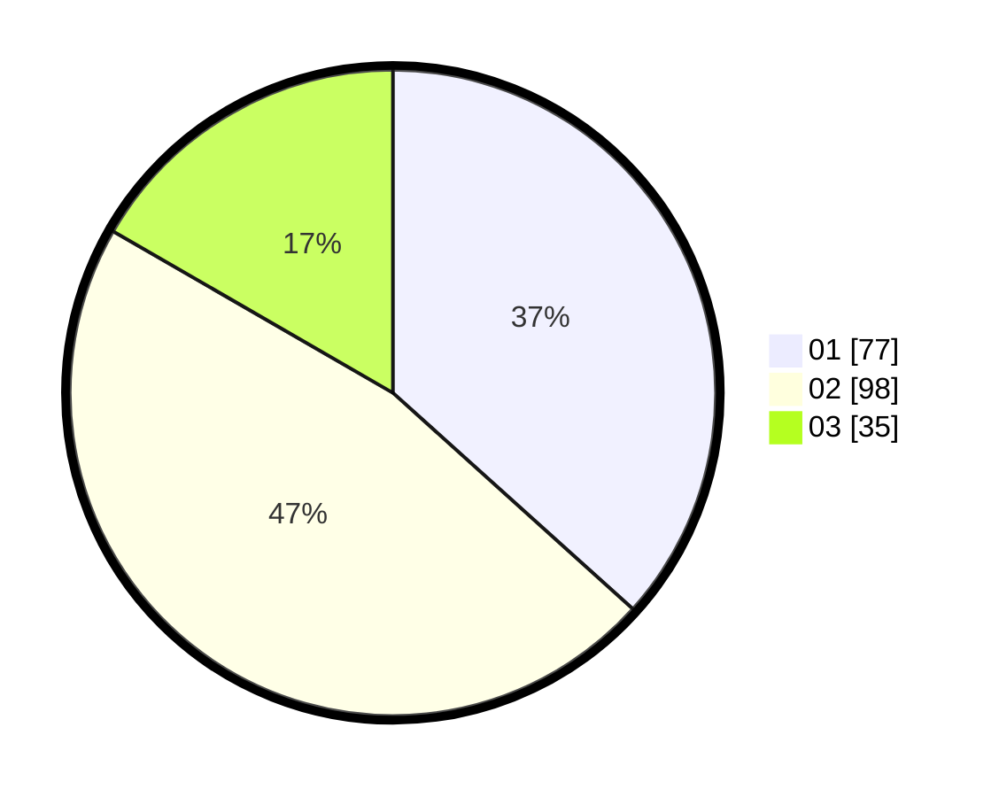

# Hasil

Hasil perolehan suara paslon dapat dilihat pada file paslon-01.txt, paslon-02.txt, dan paslon-03.txt.

Jika tidak ada, artinya data tersebut belum ada pada SIREKAP.

## Perolehan Suara

 * Paslon 01: **77**.
 * Paslon 02: **98**.
 * Paslon 03: **35**.

## Foto C Plano

https://sirekap-obj-formc.kpu.go.id/cece/pemilu/ppwp/31/71/04/10/06/3171041006045-20240217-193715--1b283874-ef48-488b-bf7e-14b2ae420c3d.jpg

https://sirekap-obj-formc.kpu.go.id/cece/pemilu/ppwp/31/71/04/10/06/3171041006045-20240217-193753--b6a02fe2-476e-4c69-90e3-d523458f69c0.jpg

https://sirekap-obj-formc.kpu.go.id/cece/pemilu/ppwp/31/71/04/10/06/3171041006045-20240217-193830--b8c5f298-e07f-4347-ba55-120c3d9d2573.jpg

## DATA PEMILIH TETAP

Jumlah pemilih dalam DPT: **259**.
 * L: **132**.
 * P: **127**.

## DATA PENGGUNA HAK PILIH

Jumlah pengguna hak pilih dalam DPT: **195**.
 * L: **99**.
 * P: **96**.

Jumlah pengguna hak pilih dalam DPTb: **15**.
 * L: **8**.
 * P: **7**.

Jumlah pengguna hak pilih dalam DPK: **3**.
 * L: **0**.
 * P: **3**.

Jumlah pengguna hak pilih: **213**.
 * L: **107**.
 * P: **106**.

## JUMLAH SUARA SAH DAN TIDAK SAH

JUMLAH SELURUH SUARA SAH: **210**.

JUMLAH SUARA TIDAK SAH: **3**.

JUMLAH SELURUH SUARA SAH DAN SUARA TIDAK SAH: **213**.
