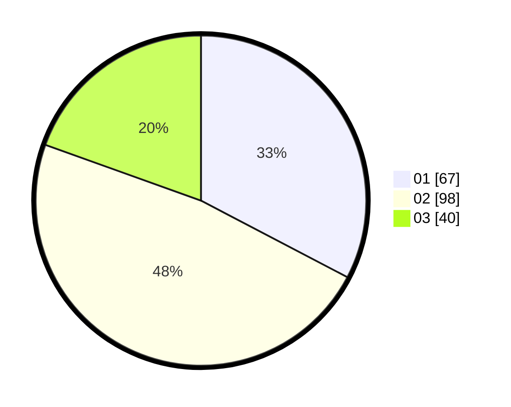

# Hasil

Hasil perolehan suara paslon dapat dilihat pada file paslon-01.txt, paslon-02.txt, dan paslon-03.txt.

Jika tidak ada, artinya data tersebut belum ada pada SIREKAP.

## Perolehan Suara

 * Paslon 01: **67**.
 * Paslon 02: **98**.
 * Paslon 03: **40**.

## Foto C Plano

https://sirekap-obj-formc.kpu.go.id/677b/pemilu/ppwp/31/71/04/10/06/3171041006046-20240217-222244--856e4a5b-2cd9-4274-864b-ada8154d996c.jpg

https://sirekap-obj-formc.kpu.go.id/677b/pemilu/ppwp/31/71/04/10/06/3171041006046-20240217-222245--587b457b-f831-45ed-b814-2771a7534699.jpg

https://sirekap-obj-formc.kpu.go.id/677b/pemilu/ppwp/31/71/04/10/06/3171041006046-20240217-222245--ebedaa71-213c-4f74-9d9d-4609e58e9ead.jpg

## DATA PEMILIH TETAP

Jumlah pemilih dalam DPT: **256**.
 * L: **126**.
 * P: **130**.

## DATA PENGGUNA HAK PILIH

Jumlah pengguna hak pilih dalam DPT: **188**.
 * L: **94**.
 * P: **94**.

Jumlah pengguna hak pilih dalam DPTb: **15**.
 * L: **8**.
 * P: **7**.

Jumlah pengguna hak pilih dalam DPK: **3**.
 * L: **1**.
 * P: **2**.

Jumlah pengguna hak pilih: **206**.
 * L: **103**.
 * P: **103**.

## JUMLAH SUARA SAH DAN TIDAK SAH

JUMLAH SELURUH SUARA SAH: **205**.

JUMLAH SUARA TIDAK SAH: **1**.

JUMLAH SELURUH SUARA SAH DAN SUARA TIDAK SAH: **206**.
