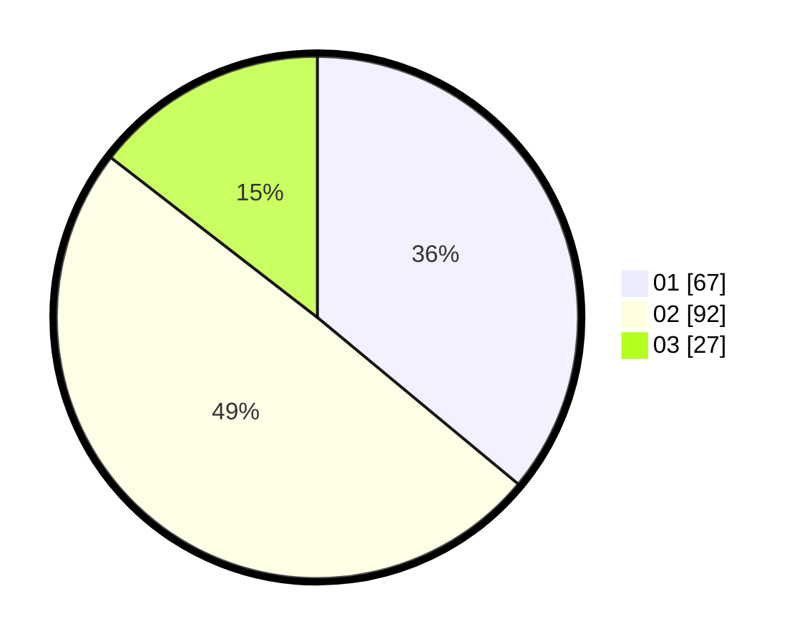

# Hasil

Hasil perolehan suara paslon dapat dilihat pada file paslon-01.txt, paslon-02.txt, dan paslon-03.txt.

Jika tidak ada, artinya data tersebut belum ada pada SIREKAP.

## Perolehan Suara

 * Paslon 01: **67**.
 * Paslon 02: **92**.
 * Paslon 03: **27**.

## Foto C Plano

https://sirekap-obj-formc.kpu.go.id/5ba8/pemilu/ppwp/31/71/04/10/06/3171041006048-20240215-013454--baacf8cb-1efc-4b4f-9f7d-669fcb5a03f9.jpg

https://sirekap-obj-formc.kpu.go.id/5ba8/pemilu/ppwp/31/71/04/10/06/3171041006048-20240215-013516--798acc65-9aec-4f16-9842-48a0e70da63d.jpg

https://sirekap-obj-formc.kpu.go.id/5ba8/pemilu/ppwp/31/71/04/10/06/3171041006048-20240215-013505--722ff9d6-74e6-4ecb-8040-fab170c1242f.jpg

## DATA PEMILIH TETAP

Jumlah pemilih dalam DPT: **262**.
 * L: **144**.
 * P: **118**.

## DATA PENGGUNA HAK PILIH

Jumlah pengguna hak pilih dalam DPT: **190**.
 * L: **101**.
 * P: **89**.

Jumlah pengguna hak pilih dalam DPTb: **0**.
 * L: **0**.
 * P: **0**.

Jumlah pengguna hak pilih dalam DPK: **2**.
 * L: **0**.
 * P: **2**.

Jumlah pengguna hak pilih: **192**.
 * L: **101**.
 * P: **91**.

## JUMLAH SUARA SAH DAN TIDAK SAH

JUMLAH SELURUH SUARA SAH: **186**.

JUMLAH SUARA TIDAK SAH: **6**.

JUMLAH SELURUH SUARA SAH DAN SUARA TIDAK SAH: **192**.
