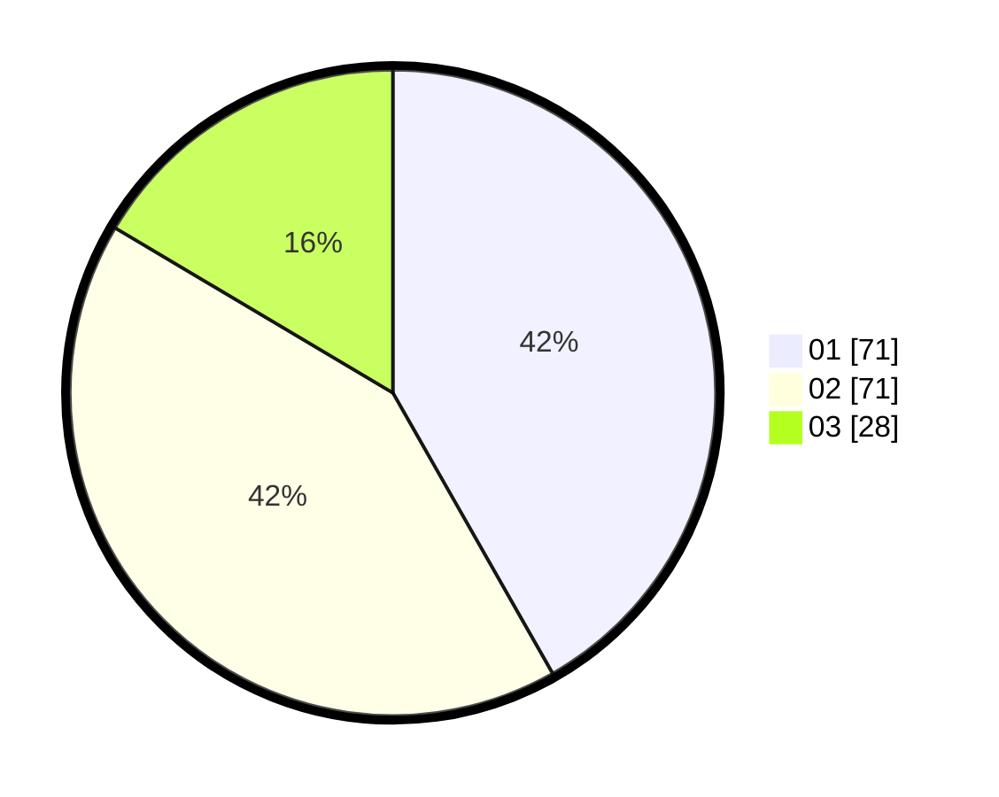

# Hasil

Hasil perolehan suara paslon dapat dilihat pada file paslon-01.txt, paslon-02.txt, dan paslon-03.txt.

Jika tidak ada, artinya data tersebut belum ada pada SIREKAP.

## Perolehan Suara

 * Paslon 01: **71**.
 * Paslon 02: **71**.
 * Paslon 03: **28**.

## Foto C Plano

https://sirekap-obj-formc.kpu.go.id/65a9/pemilu/ppwp/31/71/04/10/06/3171041006051-20240214-212420--5f4238a3-4a6a-4a8b-95c8-8ed3f71d8175.jpg

https://sirekap-obj-formc.kpu.go.id/65a9/pemilu/ppwp/31/71/04/10/06/3171041006051-20240217-112637--4637e1f1-d40b-4e30-a282-f7c2ecedb940.jpg

https://sirekap-obj-formc.kpu.go.id/65a9/pemilu/ppwp/31/71/04/10/06/3171041006051-20240217-112637--91748d77-4b4c-406f-9339-1ed80ef6ca46.jpg

## DATA PEMILIH TETAP

Jumlah pemilih dalam DPT: **278**.
 * L: **136**.
 * P: **192**.

## DATA PENGGUNA HAK PILIH

Jumlah pengguna hak pilih dalam DPT: **175**.
 * L: **82**.
 * P: **93**.

Jumlah pengguna hak pilih dalam DPTb: **0**.
 * L: **0**.
 * P: **0**.

Jumlah pengguna hak pilih dalam DPK: **0**.
 * L: **0**.
 * P: **0**.

Jumlah pengguna hak pilih: **175**.
 * L: **82**.
 * P: **93**.

## JUMLAH SUARA SAH DAN TIDAK SAH

JUMLAH SELURUH SUARA SAH: **170**.

JUMLAH SUARA TIDAK SAH: **5**.

JUMLAH SELURUH SUARA SAH DAN SUARA TIDAK SAH: **175**.
