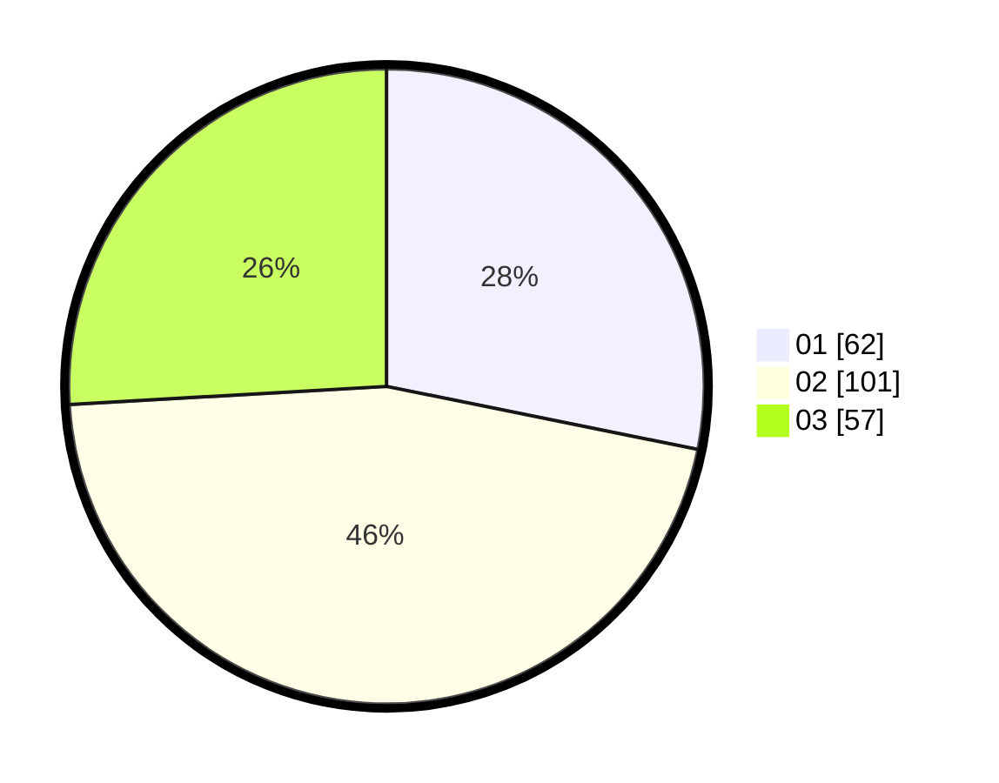

# Hasil

Hasil perolehan suara paslon dapat dilihat pada file paslon-01.txt, paslon-02.txt, dan paslon-03.txt.

Jika tidak ada, artinya data tersebut belum ada pada SIREKAP.

## Perolehan Suara

 * Paslon 01: **62**.
 * Paslon 02: **101**.
 * Paslon 03: **57**.

## Foto C Plano

https://sirekap-obj-formc.kpu.go.id/2545/pemilu/ppwp/31/71/04/10/06/3171041006054-20240216-101205--86f9446f-75d5-488a-9323-7bad7935b2fc.jpg

https://sirekap-obj-formc.kpu.go.id/2545/pemilu/ppwp/31/71/04/10/06/3171041006054-20240216-101420--31f055ce-6869-4430-b5e0-94954bff352a.jpg

https://sirekap-obj-formc.kpu.go.id/2545/pemilu/ppwp/31/71/04/10/06/3171041006054-20240216-101557--fce8c2ef-2e3f-4853-9cf5-1d33a49dd074.jpg

## DATA PEMILIH TETAP

Jumlah pemilih dalam DPT: **266**.
 * L: **132**.
 * P: **134**.

## DATA PENGGUNA HAK PILIH

Jumlah pengguna hak pilih dalam DPT: **215**.
 * L: **103**.
 * P: **112**.

Jumlah pengguna hak pilih dalam DPTb: **0**.
 * L: **0**.
 * P: **0**.

Jumlah pengguna hak pilih dalam DPK: **6**.
 * L: **4**.
 * P: **2**.

Jumlah pengguna hak pilih: **221**.
 * L: **107**.
 * P: **114**.

## JUMLAH SUARA SAH DAN TIDAK SAH

JUMLAH SELURUH SUARA SAH: **220**.

JUMLAH SUARA TIDAK SAH: **1**.

JUMLAH SELURUH SUARA SAH DAN SUARA TIDAK SAH: **221**.
