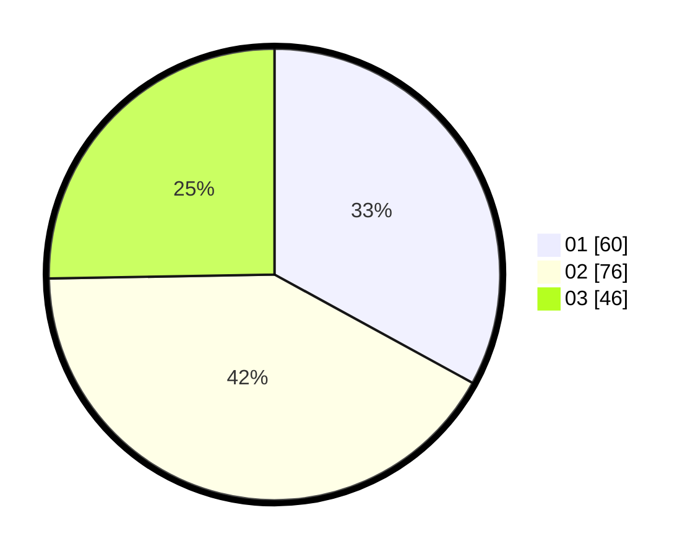

# Hasil

Hasil perolehan suara paslon dapat dilihat pada file paslon-01.txt, paslon-02.txt, dan paslon-03.txt.

Jika tidak ada, artinya data tersebut belum ada pada SIREKAP.

## Perolehan Suara

 * Paslon 01: **60**.
 * Paslon 02: **76**.
 * Paslon 03: **46**.

## Foto C Plano

https://sirekap-obj-formc.kpu.go.id/b47e/pemilu/ppwp/31/71/04/10/06/3171041006055-20240218-190113--c8c4ff37-3456-432d-bea7-3e67e4471965.jpg

https://sirekap-obj-formc.kpu.go.id/b47e/pemilu/ppwp/31/71/04/10/06/3171041006055-20240218-190521--5247cc4b-6a49-4305-925f-3bafd5813956.jpg

https://sirekap-obj-formc.kpu.go.id/b47e/pemilu/ppwp/31/71/04/10/06/3171041006055-20240218-190815--de74ae71-45c4-4e34-8bcb-8b2ec4e116e4.jpg

## DATA PEMILIH TETAP

Jumlah pemilih dalam DPT: **236**.
 * L: **112**.
 * P: **124**.

## DATA PENGGUNA HAK PILIH

Jumlah pengguna hak pilih dalam DPT: **178**.
 * L: **84**.
 * P: **94**.

Jumlah pengguna hak pilih dalam DPTb: **8**.
 * L: **5**.
 * P: **3**.

Jumlah pengguna hak pilih dalam DPK: **1**.
 * L: **0**.
 * P: **1**.

Jumlah pengguna hak pilih: **187**.
 * L: **89**.
 * P: **98**.

## JUMLAH SUARA SAH DAN TIDAK SAH

JUMLAH SELURUH SUARA SAH: **182**.

JUMLAH SUARA TIDAK SAH: **5**.

JUMLAH SELURUH SUARA SAH DAN SUARA TIDAK SAH: **187**.
