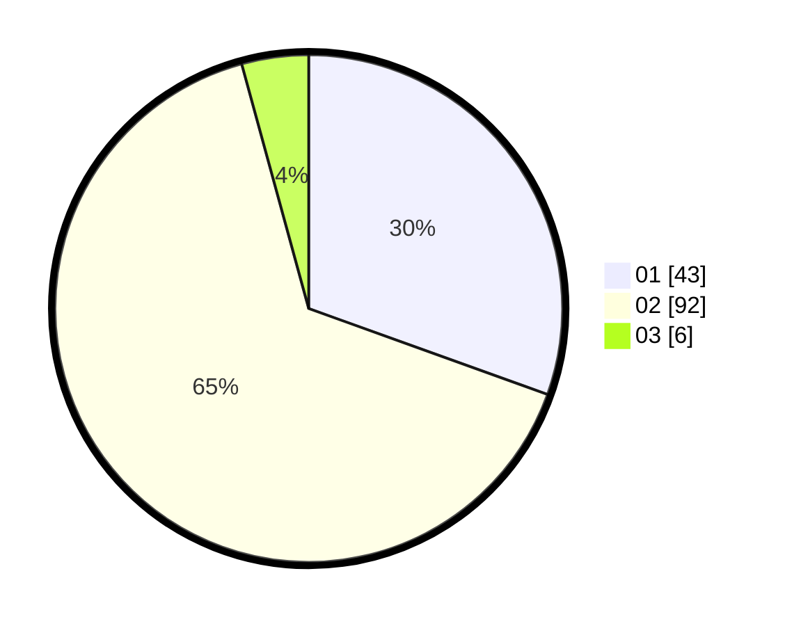

# Hasil

Hasil perolehan suara paslon dapat dilihat pada file paslon-01.txt, paslon-02.txt, dan paslon-03.txt.

Jika tidak ada, artinya data tersebut belum ada pada SIREKAP.

## Perolehan Suara

 * Paslon 01: **43**.
 * Paslon 02: **92**.
 * Paslon 03: **6**.

## Foto C Plano

https://sirekap-obj-formc.kpu.go.id/f0b4/pemilu/ppwp/31/71/04/10/06/3171041006062-20240214-184647--fe51d395-ebb4-4119-bb90-aab9f5ad8a08.jpg

https://sirekap-obj-formc.kpu.go.id/f0b4/pemilu/ppwp/31/71/04/10/06/3171041006062-20240214-184738--03ef5cad-d82a-4745-beac-42f0f592cd31.jpg

https://sirekap-obj-formc.kpu.go.id/f0b4/pemilu/ppwp/31/71/04/10/06/3171041006062-20240214-184825--c5f57e5f-9717-4baf-8a67-c8d187ca5568.jpg

## DATA PEMILIH TETAP

Jumlah pemilih dalam DPT: **172**.
 * L: **43**.
 * P: **129**.

## DATA PENGGUNA HAK PILIH

Jumlah pengguna hak pilih dalam DPT: **159**.
 * L: **39**.
 * P: **120**.

Jumlah pengguna hak pilih dalam DPTb: **13**.
 * L: **4**.
 * P: **9**.

Jumlah pengguna hak pilih dalam DPK: **0**.
 * L: **0**.
 * P: **0**.

Jumlah pengguna hak pilih: **172**.
 * L: **43**.
 * P: **129**.

## JUMLAH SUARA SAH DAN TIDAK SAH

JUMLAH SELURUH SUARA SAH: **141**.

JUMLAH SUARA TIDAK SAH: **32**.

JUMLAH SELURUH SUARA SAH DAN SUARA TIDAK SAH: **173**.
