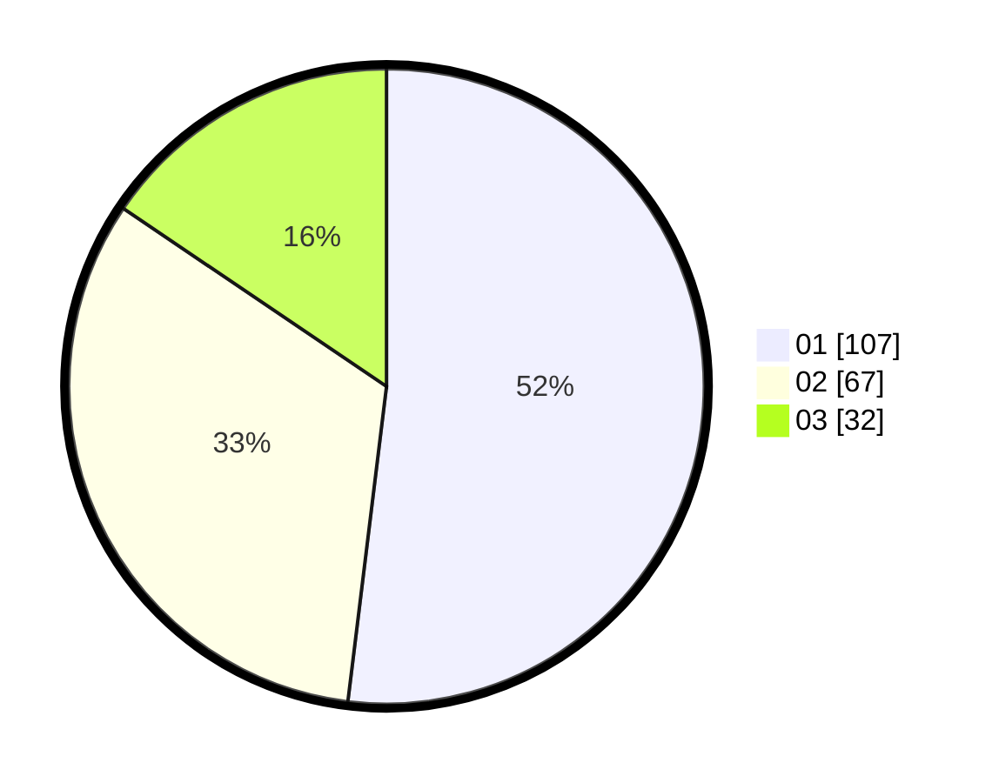

# Hasil

Hasil perolehan suara paslon dapat dilihat pada file paslon-01.txt, paslon-02.txt, dan paslon-03.txt.

Jika tidak ada, artinya data tersebut belum ada pada SIREKAP.

## Perolehan Suara

 * Paslon 01: **107**.
 * Paslon 02: **67**.
 * Paslon 03: **32**.

## Foto C Plano

https://sirekap-obj-formc.kpu.go.id/ecfd/pemilu/ppwp/31/71/05/10/01/3171051001001-20240216-154617--25cb83f1-5705-4f13-ad39-c511a193cc17.jpg

https://sirekap-obj-formc.kpu.go.id/ecfd/pemilu/ppwp/31/71/05/10/01/3171051001001-20240216-154618--d3c9dea8-b666-43a0-a7f3-d783d661c4e7.jpg

https://sirekap-obj-formc.kpu.go.id/ecfd/pemilu/ppwp/31/71/05/10/01/3171051001001-20240216-154617--735eb7b8-fa56-47af-a022-2d19d4a9c355.jpg

## DATA PEMILIH TETAP

Jumlah pemilih dalam DPT: **254**.
 * L: **123**.
 * P: **131**.

## DATA PENGGUNA HAK PILIH

Jumlah pengguna hak pilih dalam DPT: **202**.
 * L: **97**.
 * P: **105**.

Jumlah pengguna hak pilih dalam DPTb: **5**.
 * L: **3**.
 * P: **2**.

Jumlah pengguna hak pilih dalam DPK: **2**.
 * L: **1**.
 * P: **1**.

Jumlah pengguna hak pilih: **209**.
 * L: **101**.
 * P: **108**.

## JUMLAH SUARA SAH DAN TIDAK SAH

JUMLAH SELURUH SUARA SAH: **206**.

JUMLAH SUARA TIDAK SAH: **3**.

JUMLAH SELURUH SUARA SAH DAN SUARA TIDAK SAH: **209**.
