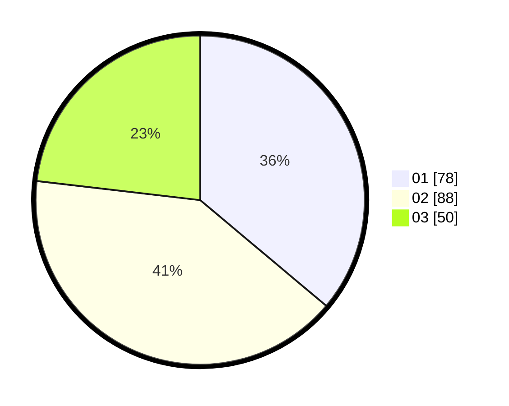

# Hasil

Hasil perolehan suara paslon dapat dilihat pada file paslon-01.txt, paslon-02.txt, dan paslon-03.txt.

Jika tidak ada, artinya data tersebut belum ada pada SIREKAP.

## Perolehan Suara

 * Paslon 01: **78**.
 * Paslon 02: **88**.
 * Paslon 03: **50**.

## Foto C Plano

https://sirekap-obj-formc.kpu.go.id/bf7d/pemilu/ppwp/31/71/05/10/01/3171051001004-20240216-110247--43923c21-708e-4082-b190-6e89a0df8334.jpg

https://sirekap-obj-formc.kpu.go.id/bf7d/pemilu/ppwp/31/71/05/10/01/3171051001004-20240216-110249--9659ef73-a163-49c8-9e18-271164a017d5.jpg

https://sirekap-obj-formc.kpu.go.id/bf7d/pemilu/ppwp/31/71/05/10/01/3171051001004-20240216-110248--5eca4c1e-8209-41cb-8e19-2e3701059fa1.jpg

## DATA PEMILIH TETAP

Jumlah pemilih dalam DPT: **219**.
 * L: **106**.
 * P: **113**.

## DATA PENGGUNA HAK PILIH

Jumlah pengguna hak pilih dalam DPT: **205**.
 * L: **100**.
 * P: **105**.

Jumlah pengguna hak pilih dalam DPTb: **7**.
 * L: **2**.
 * P: **5**.

Jumlah pengguna hak pilih dalam DPK: **7**.
 * L: **4**.
 * P: **3**.

Jumlah pengguna hak pilih: **219**.
 * L: **106**.
 * P: **113**.

## JUMLAH SUARA SAH DAN TIDAK SAH

JUMLAH SELURUH SUARA SAH: **216**.

JUMLAH SUARA TIDAK SAH: **4**.

JUMLAH SELURUH SUARA SAH DAN SUARA TIDAK SAH: **220**.
