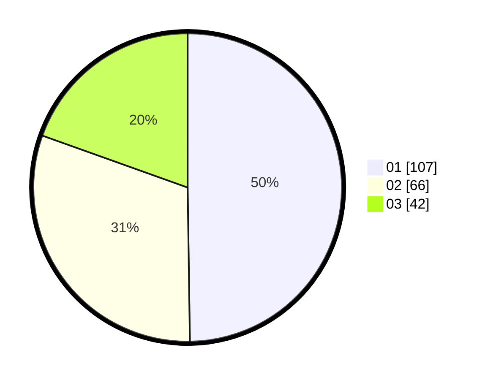

# Hasil

Hasil perolehan suara paslon dapat dilihat pada file paslon-01.txt, paslon-02.txt, dan paslon-03.txt.

Jika tidak ada, artinya data tersebut belum ada pada SIREKAP.

## Perolehan Suara

 * Paslon 01: **107**.
 * Paslon 02: **66**.
 * Paslon 03: **42**.

## Foto C Plano

https://sirekap-obj-formc.kpu.go.id/ec01/pemilu/ppwp/31/71/05/10/01/3171051001008-20240216-142420--df65918a-e118-4334-af7b-74182f618ad7.jpg

https://sirekap-obj-formc.kpu.go.id/ec01/pemilu/ppwp/31/71/05/10/01/3171051001008-20240216-142422--266a8e6a-8a59-42de-b029-faca9a07ec4f.jpg

https://sirekap-obj-formc.kpu.go.id/ec01/pemilu/ppwp/31/71/05/10/01/3171051001008-20240216-142421--59c2d828-6bee-4fba-b55c-487ff9865b88.jpg

## DATA PEMILIH TETAP

Jumlah pemilih dalam DPT: **280**.
 * L: **143**.
 * P: **137**.

## DATA PENGGUNA HAK PILIH

Jumlah pengguna hak pilih dalam DPT: **214**.
 * L: **102**.
 * P: **112**.

Jumlah pengguna hak pilih dalam DPTb: **3**.
 * L: **2**.
 * P: **1**.

Jumlah pengguna hak pilih dalam DPK: **1**.
 * L: **1**.
 * P: **0**.

Jumlah pengguna hak pilih: **218**.
 * L: **105**.
 * P: **113**.

## JUMLAH SUARA SAH DAN TIDAK SAH

JUMLAH SELURUH SUARA SAH: **215**.

JUMLAH SUARA TIDAK SAH: **3**.

JUMLAH SELURUH SUARA SAH DAN SUARA TIDAK SAH: **218**.
