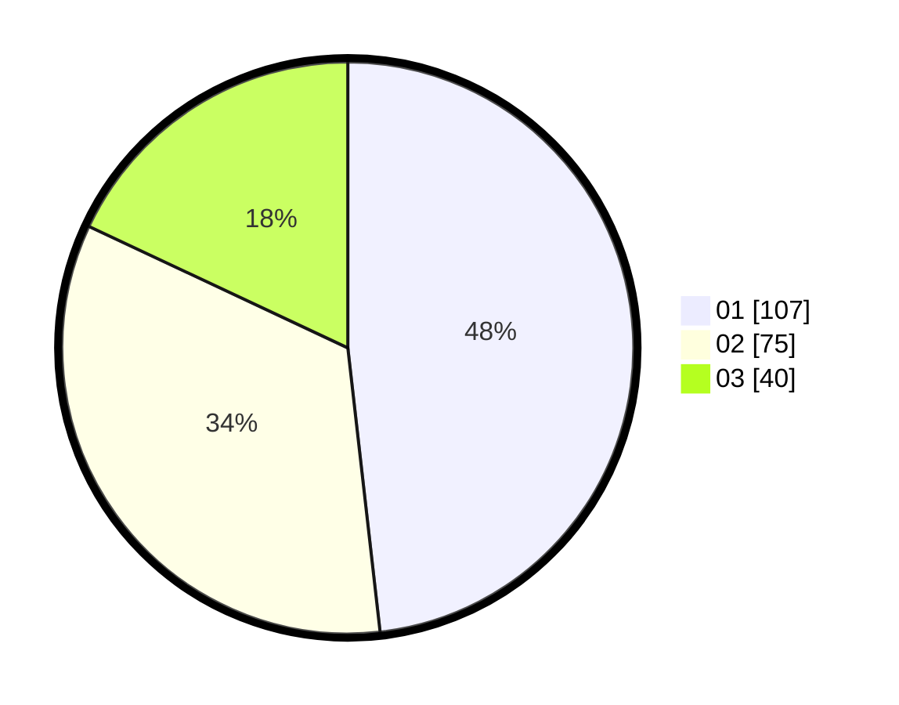

# Hasil

Hasil perolehan suara paslon dapat dilihat pada file paslon-01.txt, paslon-02.txt, dan paslon-03.txt.

Jika tidak ada, artinya data tersebut belum ada pada SIREKAP.

## Perolehan Suara

 * Paslon 01: **107**.
 * Paslon 02: **75**.
 * Paslon 03: **40**.

## Foto C Plano

https://sirekap-obj-formc.kpu.go.id/3998/pemilu/ppwp/31/71/05/10/01/3171051001010-20240215-051329--79fc9fb6-5f7e-4199-b2bd-0c9cc207152e.jpg

https://sirekap-obj-formc.kpu.go.id/3998/pemilu/ppwp/31/71/05/10/01/3171051001010-20240215-051427--4f403fde-c570-4b5c-8ba9-ae42618481ae.jpg

https://sirekap-obj-formc.kpu.go.id/3998/pemilu/ppwp/31/71/05/10/01/3171051001010-20240215-051458--09df00a3-5e3a-4ad4-a356-83bd52300145.jpg

## DATA PEMILIH TETAP

Jumlah pemilih dalam DPT: **283**.
 * L: **129**.
 * P: **154**.

## DATA PENGGUNA HAK PILIH

Jumlah pengguna hak pilih dalam DPT: **217**.
 * L: **97**.
 * P: **120**.

Jumlah pengguna hak pilih dalam DPTb: **4**.
 * L: **4**.
 * P: **0**.

Jumlah pengguna hak pilih dalam DPK: **5**.
 * L: **2**.
 * P: **3**.

Jumlah pengguna hak pilih: **226**.
 * L: **103**.
 * P: **123**.

## JUMLAH SUARA SAH DAN TIDAK SAH

JUMLAH SELURUH SUARA SAH: **222**.

JUMLAH SUARA TIDAK SAH: **4**.

JUMLAH SELURUH SUARA SAH DAN SUARA TIDAK SAH: **226**.
