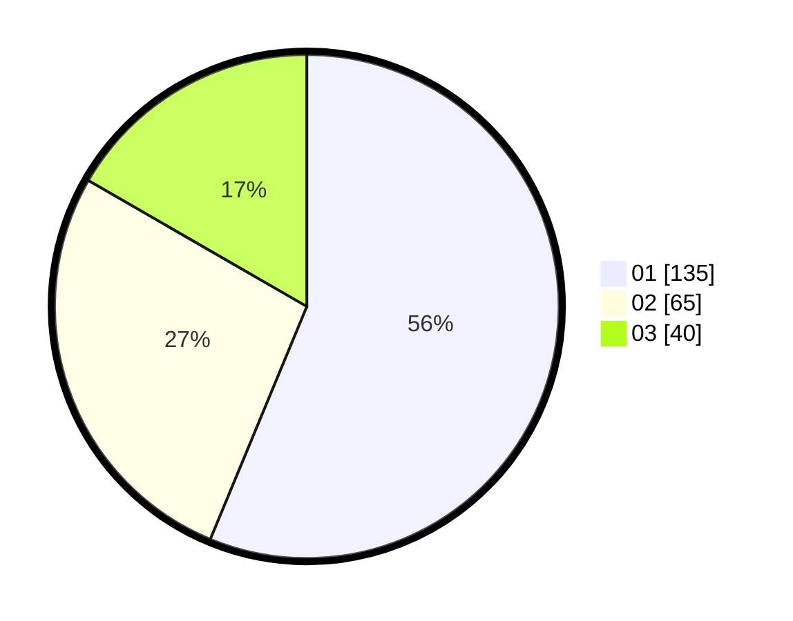

# Hasil

Hasil perolehan suara paslon dapat dilihat pada file paslon-01.txt, paslon-02.txt, dan paslon-03.txt.

Jika tidak ada, artinya data tersebut belum ada pada SIREKAP.

## Perolehan Suara

 * Paslon 01: **135**.
 * Paslon 02: **65**.
 * Paslon 03: **40**.

## Foto C Plano

https://sirekap-obj-formc.kpu.go.id/8df6/pemilu/ppwp/31/71/05/10/01/3171051001012-20240216-134852--f0f94f93-4d7a-4ee6-97ff-9b9f094dc38a.jpg

https://sirekap-obj-formc.kpu.go.id/8df6/pemilu/ppwp/31/71/05/10/01/3171051001012-20240216-134853--5286b79b-82e7-4b41-a375-01e00480805b.jpg

https://sirekap-obj-formc.kpu.go.id/8df6/pemilu/ppwp/31/71/05/10/01/3171051001012-20240216-134853--7ebe14de-1c84-450e-a21d-0586bdbbc0db.jpg

## DATA PEMILIH TETAP

Jumlah pemilih dalam DPT: **272**.
 * L: **136**.
 * P: **136**.

## DATA PENGGUNA HAK PILIH

Jumlah pengguna hak pilih dalam DPT: **233**.
 * L: **111**.
 * P: **122**.

Jumlah pengguna hak pilih dalam DPTb: **8**.
 * L: **2**.
 * P: **6**.

Jumlah pengguna hak pilih dalam DPK: **5**.
 * L: **1**.
 * P: **4**.

Jumlah pengguna hak pilih: **246**.
 * L: **114**.
 * P: **132**.

## JUMLAH SUARA SAH DAN TIDAK SAH

JUMLAH SELURUH SUARA SAH: **240**.

JUMLAH SUARA TIDAK SAH: **6**.

JUMLAH SELURUH SUARA SAH DAN SUARA TIDAK SAH: **246**.
