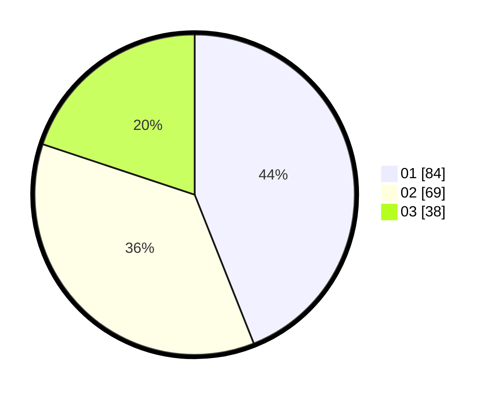

# Hasil

Hasil perolehan suara paslon dapat dilihat pada file paslon-01.txt, paslon-02.txt, dan paslon-03.txt.

Jika tidak ada, artinya data tersebut belum ada pada SIREKAP.

## Perolehan Suara

 * Paslon 01: **84**.
 * Paslon 02: **69**.
 * Paslon 03: **38**.

## Foto C Plano

https://sirekap-obj-formc.kpu.go.id/2715/pemilu/ppwp/31/71/05/10/01/3171051001013-20240216-061402--9d8375c4-f0ab-4f32-9c16-ba91d27cd437.jpg

https://sirekap-obj-formc.kpu.go.id/2715/pemilu/ppwp/31/71/05/10/01/3171051001013-20240216-061403--64fa5ee5-06c6-4b35-b397-c72c6cf742b7.jpg

https://sirekap-obj-formc.kpu.go.id/2715/pemilu/ppwp/31/71/05/10/01/3171051001013-20240216-061403--7772e29c-e07c-4493-91f4-c71a4a3a1d54.jpg

## DATA PEMILIH TETAP

Jumlah pemilih dalam DPT: **270**.
 * L: **126**.
 * P: **144**.

## DATA PENGGUNA HAK PILIH

Jumlah pengguna hak pilih dalam DPT: **185**.
 * L: **87**.
 * P: **98**.

Jumlah pengguna hak pilih dalam DPTb: **4**.
 * L: **3**.
 * P: **1**.

Jumlah pengguna hak pilih dalam DPK: **5**.
 * L: **1**.
 * P: **4**.

Jumlah pengguna hak pilih: **194**.
 * L: **91**.
 * P: **103**.

## JUMLAH SUARA SAH DAN TIDAK SAH

JUMLAH SELURUH SUARA SAH: **191**.

JUMLAH SUARA TIDAK SAH: **3**.

JUMLAH SELURUH SUARA SAH DAN SUARA TIDAK SAH: **194**.
