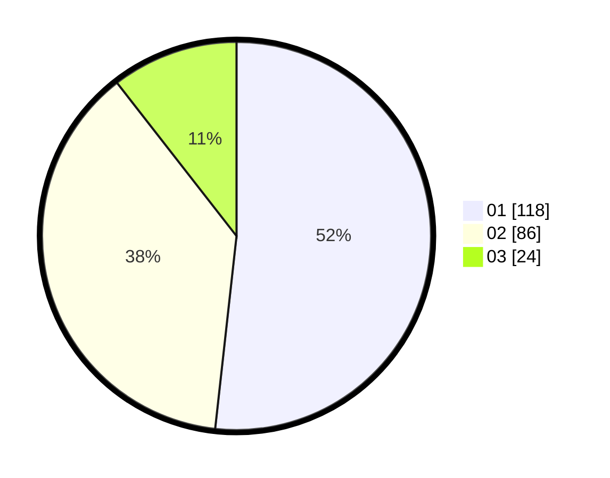

# Hasil

Hasil perolehan suara paslon dapat dilihat pada file paslon-01.txt, paslon-02.txt, dan paslon-03.txt.

Jika tidak ada, artinya data tersebut belum ada pada SIREKAP.

## Perolehan Suara

 * Paslon 01: **118**.
 * Paslon 02: **86**.
 * Paslon 03: **24**.

## Foto C Plano

https://sirekap-obj-formc.kpu.go.id/2a37/pemilu/ppwp/31/71/05/10/01/3171051001014-20240215-020859--838e2704-c5b3-4d38-a260-3b1d40a90872.jpg

https://sirekap-obj-formc.kpu.go.id/2a37/pemilu/ppwp/31/71/05/10/01/3171051001014-20240214-233751--d1f43633-2643-4758-b679-da0da674f85f.jpg

https://sirekap-obj-formc.kpu.go.id/2a37/pemilu/ppwp/31/71/05/10/01/3171051001014-20240215-104051--87f3fcb7-a275-4103-a44b-5ae25b862331.jpg

## DATA PEMILIH TETAP

Jumlah pemilih dalam DPT: **289**.
 * L: **140**.
 * P: **149**.

## DATA PENGGUNA HAK PILIH

Jumlah pengguna hak pilih dalam DPT: **220**.
 * L: **100**.
 * P: **120**.

Jumlah pengguna hak pilih dalam DPTb: **6**.
 * L: **3**.
 * P: **3**.

Jumlah pengguna hak pilih dalam DPK: **5**.
 * L: **3**.
 * P: **2**.

Jumlah pengguna hak pilih: **231**.
 * L: **106**.
 * P: **125**.

## JUMLAH SUARA SAH DAN TIDAK SAH

JUMLAH SELURUH SUARA SAH: **228**.

JUMLAH SUARA TIDAK SAH: **3**.

JUMLAH SELURUH SUARA SAH DAN SUARA TIDAK SAH: **231**.
