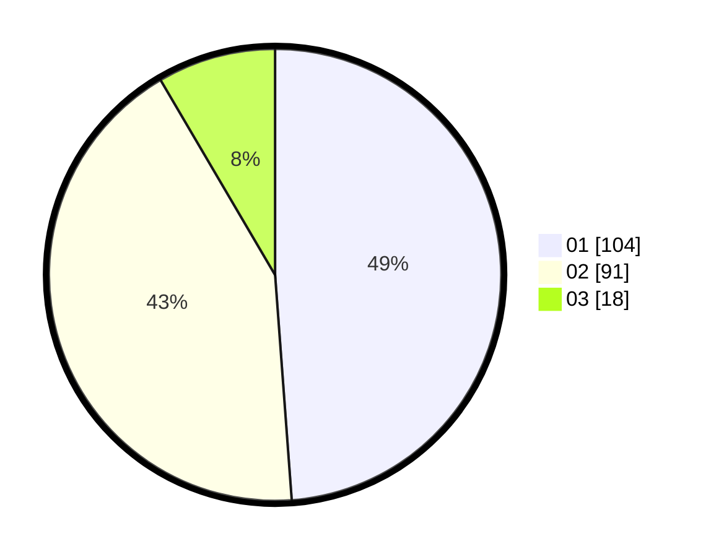

# Hasil

Hasil perolehan suara paslon dapat dilihat pada file paslon-01.txt, paslon-02.txt, dan paslon-03.txt.

Jika tidak ada, artinya data tersebut belum ada pada SIREKAP.

## Perolehan Suara

 * Paslon 01: **104**.
 * Paslon 02: **91**.
 * Paslon 03: **18**.

## Foto C Plano

https://sirekap-obj-formc.kpu.go.id/13d9/pemilu/ppwp/31/71/05/10/01/3171051001017-20240215-221335--3c30e45f-0727-407d-9c74-d33be605e209.jpg

https://sirekap-obj-formc.kpu.go.id/13d9/pemilu/ppwp/31/71/05/10/01/3171051001017-20240215-221338--cd8269fa-298f-4675-a4e4-233a1ee42cbb.jpg

https://sirekap-obj-formc.kpu.go.id/13d9/pemilu/ppwp/31/71/05/10/01/3171051001017-20240215-221337--13e925aa-db6d-4fd5-b7d6-6db4e9ae9b23.jpg

## DATA PEMILIH TETAP

Jumlah pemilih dalam DPT: **282**.
 * L: **139**.
 * P: **143**.

## DATA PENGGUNA HAK PILIH

Jumlah pengguna hak pilih dalam DPT: **211**.
 * L: **99**.
 * P: **112**.

Jumlah pengguna hak pilih dalam DPTb: **0**.
 * L: **0**.
 * P: **0**.

Jumlah pengguna hak pilih dalam DPK: **6**.
 * L: **2**.
 * P: **4**.

Jumlah pengguna hak pilih: **217**.
 * L: **101**.
 * P: **116**.

## JUMLAH SUARA SAH DAN TIDAK SAH

JUMLAH SELURUH SUARA SAH: **213**.

JUMLAH SUARA TIDAK SAH: **4**.

JUMLAH SELURUH SUARA SAH DAN SUARA TIDAK SAH: **217**.
