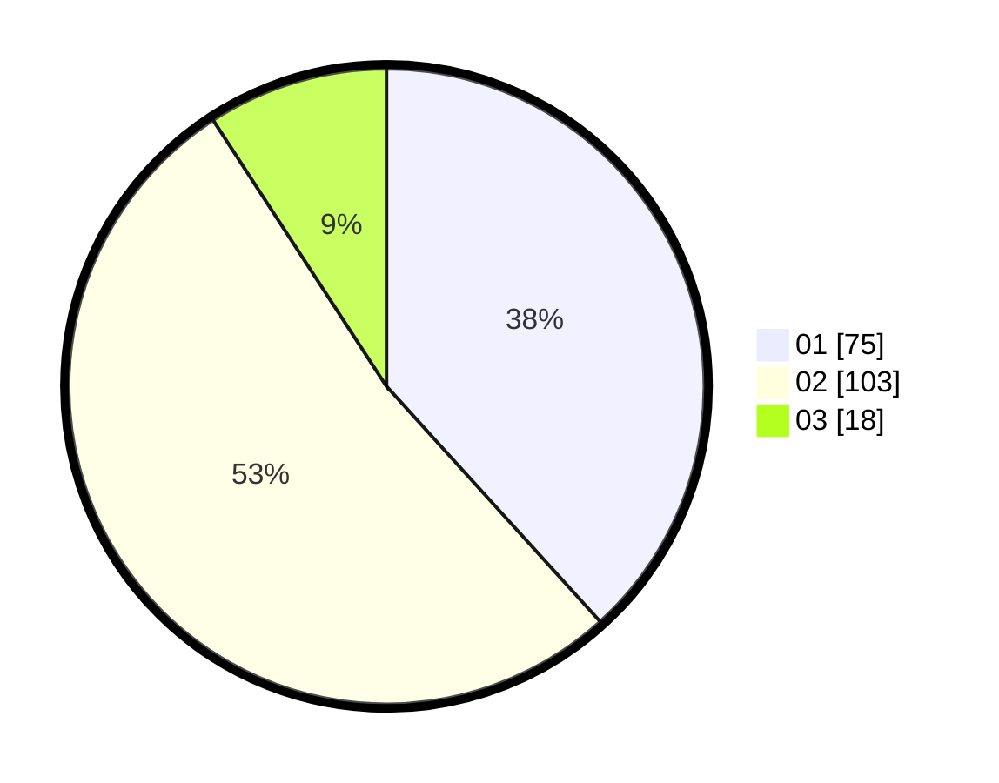

# Hasil

Hasil perolehan suara paslon dapat dilihat pada file paslon-01.txt, paslon-02.txt, dan paslon-03.txt.

Jika tidak ada, artinya data tersebut belum ada pada SIREKAP.

## Perolehan Suara

 * Paslon 01: **75**.
 * Paslon 02: **103**.
 * Paslon 03: **18**.

## Foto C Plano

https://sirekap-obj-formc.kpu.go.id/ca3c/pemilu/ppwp/31/71/05/10/01/3171051001018-20240216-050446--f761df70-5101-4387-8355-672cc364c506.jpg

https://sirekap-obj-formc.kpu.go.id/ca3c/pemilu/ppwp/31/71/05/10/01/3171051001018-20240216-050447--8f963cd0-a832-4ad7-9bd3-38d4596c888d.jpg

https://sirekap-obj-formc.kpu.go.id/ca3c/pemilu/ppwp/31/71/05/10/01/3171051001018-20240216-050447--3bc7c202-ee3d-4aaf-a3f5-246fabc2350f.jpg

## DATA PEMILIH TETAP

Jumlah pemilih dalam DPT: **0**.
 * L: **0**.
 * P: **0**.

## DATA PENGGUNA HAK PILIH

Jumlah pengguna hak pilih dalam DPT: **288**.
 * L: **143**.
 * P: **145**.

Jumlah pengguna hak pilih dalam DPTb: **4**.
 * L: **3**.
 * P: **1**.

Jumlah pengguna hak pilih dalam DPK: **0**.
 * L: **0**.
 * P: **0**.

Jumlah pengguna hak pilih: **196**.
 * L: **95**.
 * P: **101**.

## JUMLAH SUARA SAH DAN TIDAK SAH

JUMLAH SELURUH SUARA SAH: **196**.

JUMLAH SUARA TIDAK SAH: **0**.

JUMLAH SELURUH SUARA SAH DAN SUARA TIDAK SAH: **196**.
