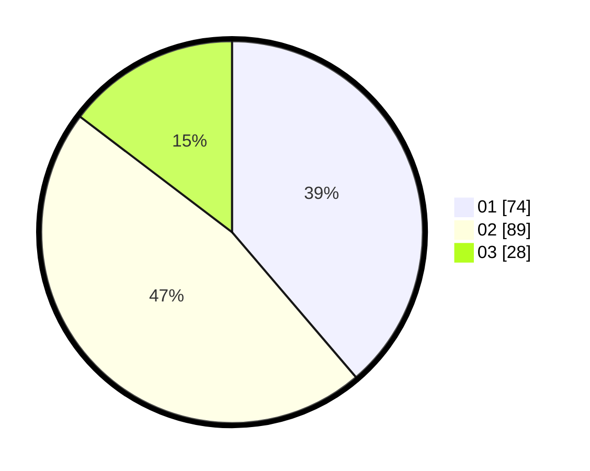

# Hasil

Hasil perolehan suara paslon dapat dilihat pada file paslon-01.txt, paslon-02.txt, dan paslon-03.txt.

Jika tidak ada, artinya data tersebut belum ada pada SIREKAP.

## Perolehan Suara

 * Paslon 01: **74**.
 * Paslon 02: **89**.
 * Paslon 03: **28**.

## Foto C Plano

https://sirekap-obj-formc.kpu.go.id/d84c/pemilu/ppwp/31/71/05/10/01/3171051001019-20240216-015348--06d9cd75-18bf-4cda-81e3-b35c94b86793.jpg

https://sirekap-obj-formc.kpu.go.id/d84c/pemilu/ppwp/31/71/05/10/01/3171051001019-20240216-015350--cd90ea9b-d8b7-4e6c-9b58-b7834850ff06.jpg

https://sirekap-obj-formc.kpu.go.id/d84c/pemilu/ppwp/31/71/05/10/01/3171051001019-20240216-015349--c2bb34ce-90a2-47f8-bf22-10363a2391d0.jpg

## DATA PEMILIH TETAP

Jumlah pemilih dalam DPT: **288**.
 * L: **135**.
 * P: **153**.

## DATA PENGGUNA HAK PILIH

Jumlah pengguna hak pilih dalam DPT: **191**.
 * L: **84**.
 * P: **107**.

Jumlah pengguna hak pilih dalam DPTb: **2**.
 * L: **0**.
 * P: **2**.

Jumlah pengguna hak pilih dalam DPK: **4**.
 * L: **2**.
 * P: **2**.

Jumlah pengguna hak pilih: **197**.
 * L: **86**.
 * P: **111**.

## JUMLAH SUARA SAH DAN TIDAK SAH

JUMLAH SELURUH SUARA SAH: **191**.

JUMLAH SUARA TIDAK SAH: **6**.

JUMLAH SELURUH SUARA SAH DAN SUARA TIDAK SAH: **197**.
