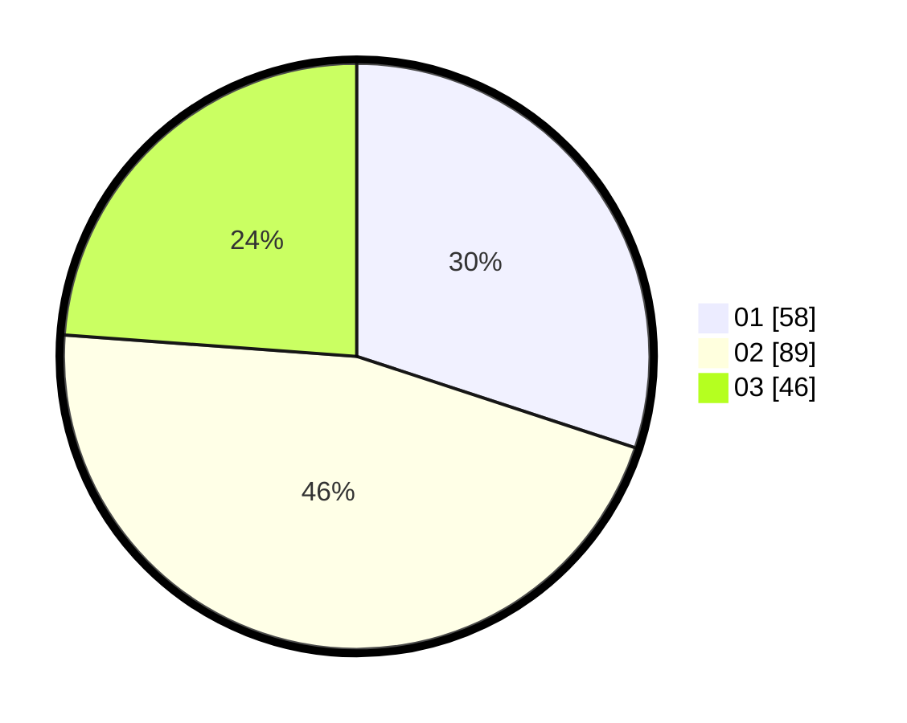

# Hasil

Hasil perolehan suara paslon dapat dilihat pada file paslon-01.txt, paslon-02.txt, dan paslon-03.txt.

Jika tidak ada, artinya data tersebut belum ada pada SIREKAP.

## Perolehan Suara

 * Paslon 01: **58**.
 * Paslon 02: **89**.
 * Paslon 03: **46**.

## Foto C Plano

https://sirekap-obj-formc.kpu.go.id/c598/pemilu/ppwp/31/71/05/10/01/3171051001020-20240214-155127--311cc0b6-0ff6-472c-aae5-494c47462bf8.jpg

https://sirekap-obj-formc.kpu.go.id/c598/pemilu/ppwp/31/71/05/10/01/3171051001020-20240214-155423--f96ffcc5-b343-45cc-af6f-4b7619ee4e69.jpg

https://sirekap-obj-formc.kpu.go.id/c598/pemilu/ppwp/31/71/05/10/01/3171051001020-20240214-225522--0ac8c7f8-ee21-45a2-bc67-f8ec52bf47a2.jpg
