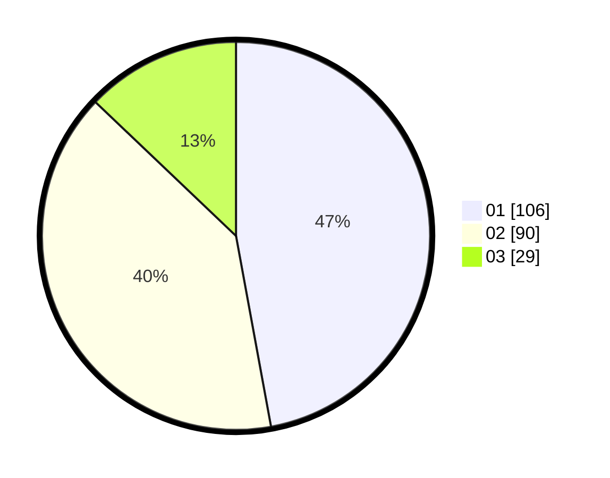

# Hasil

Hasil perolehan suara paslon dapat dilihat pada file paslon-01.txt, paslon-02.txt, dan paslon-03.txt.

Jika tidak ada, artinya data tersebut belum ada pada SIREKAP.

## Perolehan Suara

 * Paslon 01: **106**.
 * Paslon 02: **90**.
 * Paslon 03: **29**.

## Foto C Plano

https://sirekap-obj-formc.kpu.go.id/b10c/pemilu/ppwp/31/71/05/10/01/3171051001022-20240215-025928--61653892-3ac9-40a8-a3c3-82cef9a0e30b.jpg

https://sirekap-obj-formc.kpu.go.id/b10c/pemilu/ppwp/31/71/05/10/01/3171051001022-20240215-030004--1e5c5919-b618-450d-a6b7-c4a80f47afd9.jpg

https://sirekap-obj-formc.kpu.go.id/b10c/pemilu/ppwp/31/71/05/10/01/3171051001022-20240215-030110--b3f60baf-0232-4c61-a0d8-4921d72f1d93.jpg

## DATA PEMILIH TETAP

Jumlah pemilih dalam DPT: **280**.
 * L: **136**.
 * P: **144**.

## DATA PENGGUNA HAK PILIH

Jumlah pengguna hak pilih dalam DPT: **221**.
 * L: **100**.
 * P: **121**.

Jumlah pengguna hak pilih dalam DPTb: **0**.
 * L: **3**.
 * P: **3**.

Jumlah pengguna hak pilih dalam DPK: **0**.
 * L: **0**.
 * P: **0**.

Jumlah pengguna hak pilih: **227**.
 * L: **103**.
 * P: **124**.

## JUMLAH SUARA SAH DAN TIDAK SAH

JUMLAH SELURUH SUARA SAH: **225**.

JUMLAH SUARA TIDAK SAH: **2**.

JUMLAH SELURUH SUARA SAH DAN SUARA TIDAK SAH: **227**.
