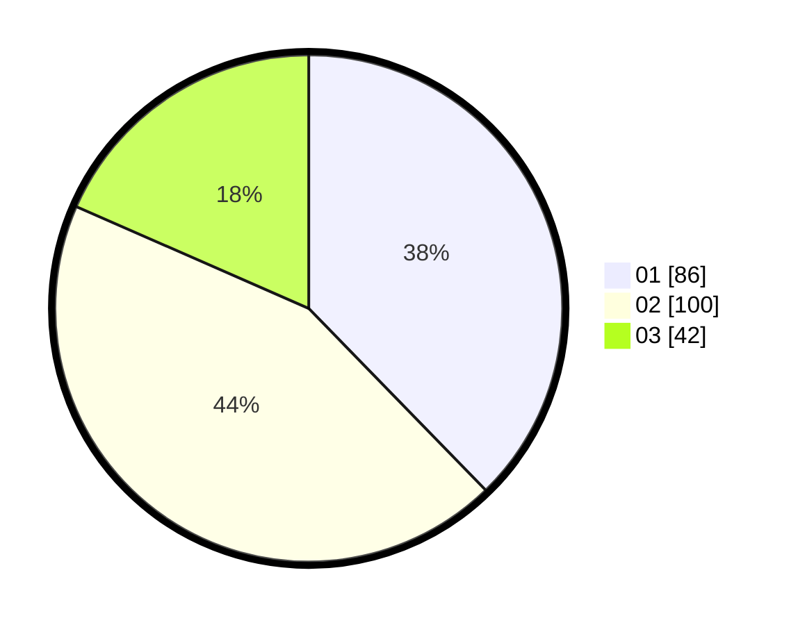

# Hasil

Hasil perolehan suara paslon dapat dilihat pada file paslon-01.txt, paslon-02.txt, dan paslon-03.txt.

Jika tidak ada, artinya data tersebut belum ada pada SIREKAP.

## Perolehan Suara

 * Paslon 01: **86**.
 * Paslon 02: **100**.
 * Paslon 03: **42**.

## Foto C Plano

https://sirekap-obj-formc.kpu.go.id/a7f3/pemilu/ppwp/31/71/05/10/01/3171051001026-20240215-235115--eba27ea5-1aa1-4ef9-995d-99d670e94d9b.jpg

https://sirekap-obj-formc.kpu.go.id/a7f3/pemilu/ppwp/31/71/05/10/01/3171051001026-20240215-235118--c55af640-350c-4b6e-91a4-5e549213464b.jpg

https://sirekap-obj-formc.kpu.go.id/a7f3/pemilu/ppwp/31/71/05/10/01/3171051001026-20240215-235117--74ba1198-6c27-4b6f-a03e-492f3477563e.jpg

## DATA PEMILIH TETAP

Jumlah pemilih dalam DPT: **278**.
 * L: **132**.
 * P: **146**.

## DATA PENGGUNA HAK PILIH

Jumlah pengguna hak pilih dalam DPT: **224**.
 * L: **105**.
 * P: **119**.

Jumlah pengguna hak pilih dalam DPTb: **3**.
 * L: **2**.
 * P: **1**.

Jumlah pengguna hak pilih dalam DPK: **4**.
 * L: **4**.
 * P: **0**.

Jumlah pengguna hak pilih: **231**.
 * L: **111**.
 * P: **120**.

## JUMLAH SUARA SAH DAN TIDAK SAH

JUMLAH SELURUH SUARA SAH: **228**.

JUMLAH SUARA TIDAK SAH: **3**.

JUMLAH SELURUH SUARA SAH DAN SUARA TIDAK SAH: **231**.
