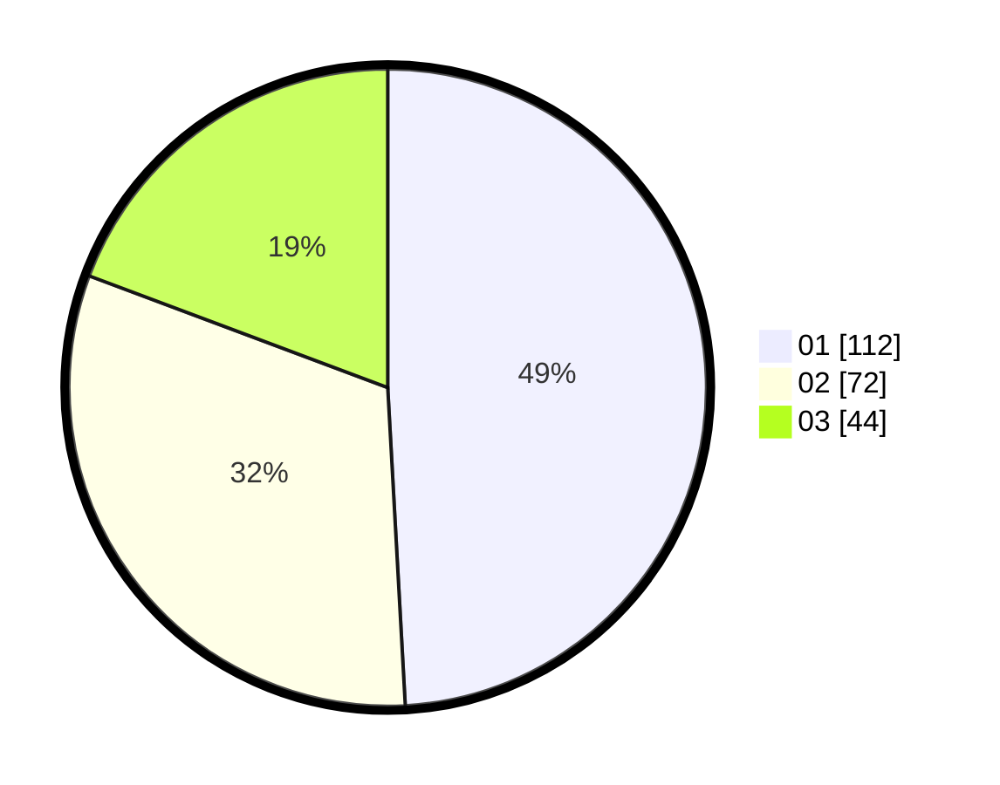

# Hasil

Hasil perolehan suara paslon dapat dilihat pada file paslon-01.txt, paslon-02.txt, dan paslon-03.txt.

Jika tidak ada, artinya data tersebut belum ada pada SIREKAP.

## Perolehan Suara

 * Paslon 01: **112**.
 * Paslon 02: **72**.
 * Paslon 03: **44**.

## Foto C Plano

https://sirekap-obj-formc.kpu.go.id/8e01/pemilu/ppwp/31/71/05/10/01/3171051001028-20240214-231913--7efd250b-a61f-4ca6-a4c2-7d193ed93357.jpg

https://sirekap-obj-formc.kpu.go.id/8e01/pemilu/ppwp/31/71/05/10/01/3171051001028-20240215-074424--c2a8c6a8-8f09-4086-bdbb-14b99c48d152.jpg

https://sirekap-obj-formc.kpu.go.id/8e01/pemilu/ppwp/31/71/05/10/01/3171051001028-20240214-232111--1f319aba-7fd8-4e90-ad88-ce7596443b82.jpg

## DATA PEMILIH TETAP

Jumlah pemilih dalam DPT: **284**.
 * L: **139**.
 * P: **145**.

## DATA PENGGUNA HAK PILIH

Jumlah pengguna hak pilih dalam DPT: **221**.
 * L: **104**.
 * P: **117**.

Jumlah pengguna hak pilih dalam DPTb: **5**.
 * L: **3**.
 * P: **2**.

Jumlah pengguna hak pilih dalam DPK: **5**.
 * L: **4**.
 * P: **1**.

Jumlah pengguna hak pilih: **231**.
 * L: **111**.
 * P: **120**.

## JUMLAH SUARA SAH DAN TIDAK SAH

JUMLAH SELURUH SUARA SAH: **228**.

JUMLAH SUARA TIDAK SAH: **3**.

JUMLAH SELURUH SUARA SAH DAN SUARA TIDAK SAH: **231**.
