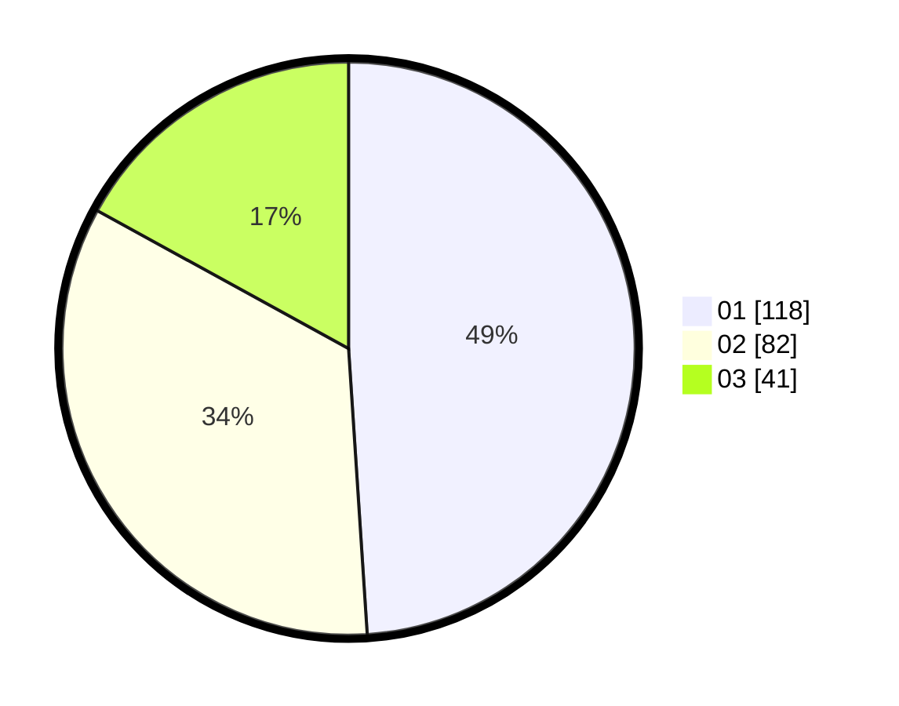

# Hasil

Hasil perolehan suara paslon dapat dilihat pada file paslon-01.txt, paslon-02.txt, dan paslon-03.txt.

Jika tidak ada, artinya data tersebut belum ada pada SIREKAP.

## Perolehan Suara

 * Paslon 01: **118**.
 * Paslon 02: **82**.
 * Paslon 03: **41**.

## Foto C Plano

https://sirekap-obj-formc.kpu.go.id/cda1/pemilu/ppwp/31/71/05/10/01/3171051001029-20240215-213150--0caf33bf-3aac-4098-91b5-23021d5e63fd.jpg

https://sirekap-obj-formc.kpu.go.id/cda1/pemilu/ppwp/31/71/05/10/01/3171051001029-20240215-213153--2cabe0f9-09f9-4adc-93f8-0e5cc4d5b34e.jpg

https://sirekap-obj-formc.kpu.go.id/cda1/pemilu/ppwp/31/71/05/10/01/3171051001029-20240215-213152--67cd502b-9ff7-4f12-9cc6-f2e17e36c338.jpg

## DATA PEMILIH TETAP

Jumlah pemilih dalam DPT: **282**.
 * L: **128**.
 * P: **154**.

## DATA PENGGUNA HAK PILIH

Jumlah pengguna hak pilih dalam DPT: **235**.
 * L: **112**.
 * P: **123**.

Jumlah pengguna hak pilih dalam DPTb: **9**.
 * L: **5**.
 * P: **4**.

Jumlah pengguna hak pilih dalam DPK: **0**.
 * L: **0**.
 * P: **0**.

Jumlah pengguna hak pilih: **244**.
 * L: **117**.
 * P: **127**.

## JUMLAH SUARA SAH DAN TIDAK SAH

JUMLAH SELURUH SUARA SAH: **241**.

JUMLAH SUARA TIDAK SAH: **3**.

JUMLAH SELURUH SUARA SAH DAN SUARA TIDAK SAH: **244**.
