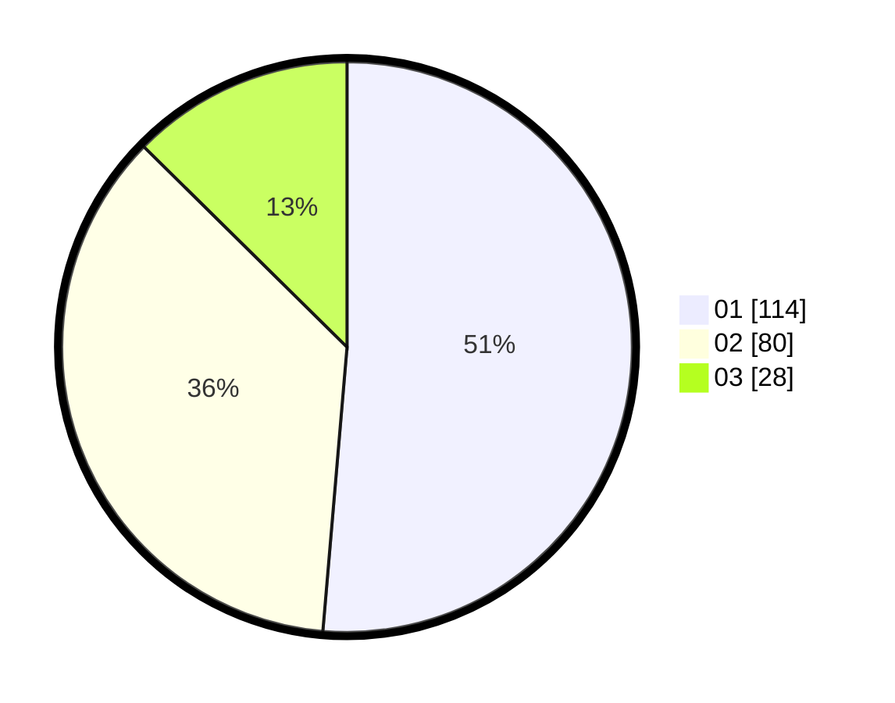

# Hasil

Hasil perolehan suara paslon dapat dilihat pada file paslon-01.txt, paslon-02.txt, dan paslon-03.txt.

Jika tidak ada, artinya data tersebut belum ada pada SIREKAP.

## Perolehan Suara

 * Paslon 01: **114**.
 * Paslon 02: **80**.
 * Paslon 03: **28**.

## Foto C Plano

https://sirekap-obj-formc.kpu.go.id/3c38/pemilu/ppwp/31/71/05/10/01/3171051001031-20240214-213524--0d140696-4193-4090-9c9f-eaa16a0ab880.jpg

https://sirekap-obj-formc.kpu.go.id/3c38/pemilu/ppwp/31/71/05/10/01/3171051001031-20240214-213715--44289cb5-8a9f-485c-806f-79f1c0519673.jpg

https://sirekap-obj-formc.kpu.go.id/3c38/pemilu/ppwp/31/71/05/10/01/3171051001031-20240214-213814--4bfbe145-54fb-4f88-8e62-c8848db24324.jpg

## DATA PEMILIH TETAP

Jumlah pemilih dalam DPT: **276**.
 * L: **140**.
 * P: **136**.

## DATA PENGGUNA HAK PILIH

Jumlah pengguna hak pilih dalam DPT: **212**.
 * L: **102**.
 * P: **110**.

Jumlah pengguna hak pilih dalam DPTb: **8**.
 * L: **3**.
 * P: **5**.

Jumlah pengguna hak pilih dalam DPK: **4**.
 * L: **2**.
 * P: **2**.

Jumlah pengguna hak pilih: **224**.
 * L: **107**.
 * P: **117**.

## JUMLAH SUARA SAH DAN TIDAK SAH

JUMLAH SELURUH SUARA SAH: **222**.

JUMLAH SUARA TIDAK SAH: **3**.

JUMLAH SELURUH SUARA SAH DAN SUARA TIDAK SAH: **225**.
