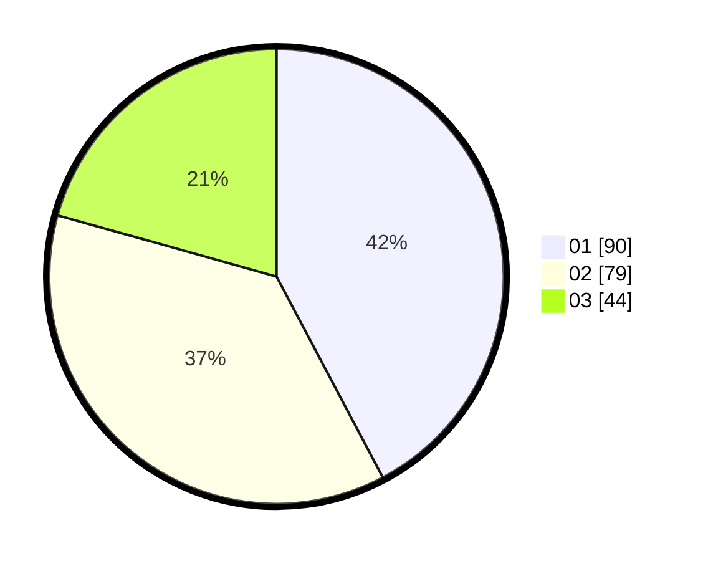

# Hasil

Hasil perolehan suara paslon dapat dilihat pada file paslon-01.txt, paslon-02.txt, dan paslon-03.txt.

Jika tidak ada, artinya data tersebut belum ada pada SIREKAP.

## Perolehan Suara

 * Paslon 01: **90**.
 * Paslon 02: **79**.
 * Paslon 03: **44**.

## Foto C Plano

https://sirekap-obj-formc.kpu.go.id/f160/pemilu/ppwp/31/71/05/10/01/3171051001032-20240214-192942--4b3c8e60-8671-477a-80be-8eaa749b55ec.jpg

https://sirekap-obj-formc.kpu.go.id/f160/pemilu/ppwp/31/71/05/10/01/3171051001032-20240214-193121--1d7e6c3c-47ba-4701-9cae-ecb9e9a72550.jpg

https://sirekap-obj-formc.kpu.go.id/f160/pemilu/ppwp/31/71/05/10/01/3171051001032-20240214-193315--2bbfaefd-059c-4589-a515-bae81fdfbe6e.jpg

## DATA PEMILIH TETAP

Jumlah pemilih dalam DPT: **281**.
 * L: **135**.
 * P: **146**.

## DATA PENGGUNA HAK PILIH

Jumlah pengguna hak pilih dalam DPT: **211**.
 * L: **94**.
 * P: **117**.

Jumlah pengguna hak pilih dalam DPTb: **0**.
 * L: **0**.
 * P: **0**.

Jumlah pengguna hak pilih dalam DPK: **3**.
 * L: **2**.
 * P: **1**.

Jumlah pengguna hak pilih: **214**.
 * L: **96**.
 * P: **118**.

## JUMLAH SUARA SAH DAN TIDAK SAH

JUMLAH SELURUH SUARA SAH: **213**.

JUMLAH SUARA TIDAK SAH: **1**.

JUMLAH SELURUH SUARA SAH DAN SUARA TIDAK SAH: **214**.
