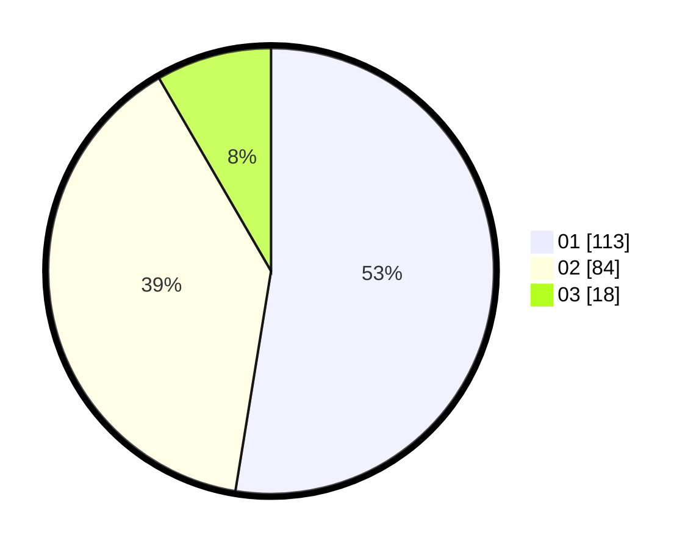

# Hasil

Hasil perolehan suara paslon dapat dilihat pada file paslon-01.txt, paslon-02.txt, dan paslon-03.txt.

Jika tidak ada, artinya data tersebut belum ada pada SIREKAP.

## Perolehan Suara

 * Paslon 01: **113**.
 * Paslon 02: **84**.
 * Paslon 03: **18**.

## Foto C Plano

https://sirekap-obj-formc.kpu.go.id/1eac/pemilu/ppwp/31/71/05/10/01/3171051001034-20240215-014858--b419d06c-d28b-4f83-a680-7a3c98ac4e1d.jpg

https://sirekap-obj-formc.kpu.go.id/1eac/pemilu/ppwp/31/71/05/10/01/3171051001034-20240215-031646--5fb3d323-99db-4b04-bdfa-4ff47ba102b2.jpg

https://sirekap-obj-formc.kpu.go.id/1eac/pemilu/ppwp/31/71/05/10/01/3171051001034-20240215-031921--fd0a86f9-6f42-4246-bd1d-61f786375441.jpg

## DATA PEMILIH TETAP

Jumlah pemilih dalam DPT: **278**.
 * L: **137**.
 * P: **141**.

## DATA PENGGUNA HAK PILIH

Jumlah pengguna hak pilih dalam DPT: **214**.
 * L: **98**.
 * P: **116**.

Jumlah pengguna hak pilih dalam DPTb: **0**.
 * L: **0**.
 * P: **0**.

Jumlah pengguna hak pilih dalam DPK: **8**.
 * L: **3**.
 * P: **5**.

Jumlah pengguna hak pilih: **222**.
 * L: **101**.
 * P: **121**.

## JUMLAH SUARA SAH DAN TIDAK SAH

JUMLAH SELURUH SUARA SAH: **215**.

JUMLAH SUARA TIDAK SAH: **7**.

JUMLAH SELURUH SUARA SAH DAN SUARA TIDAK SAH: **222**.
