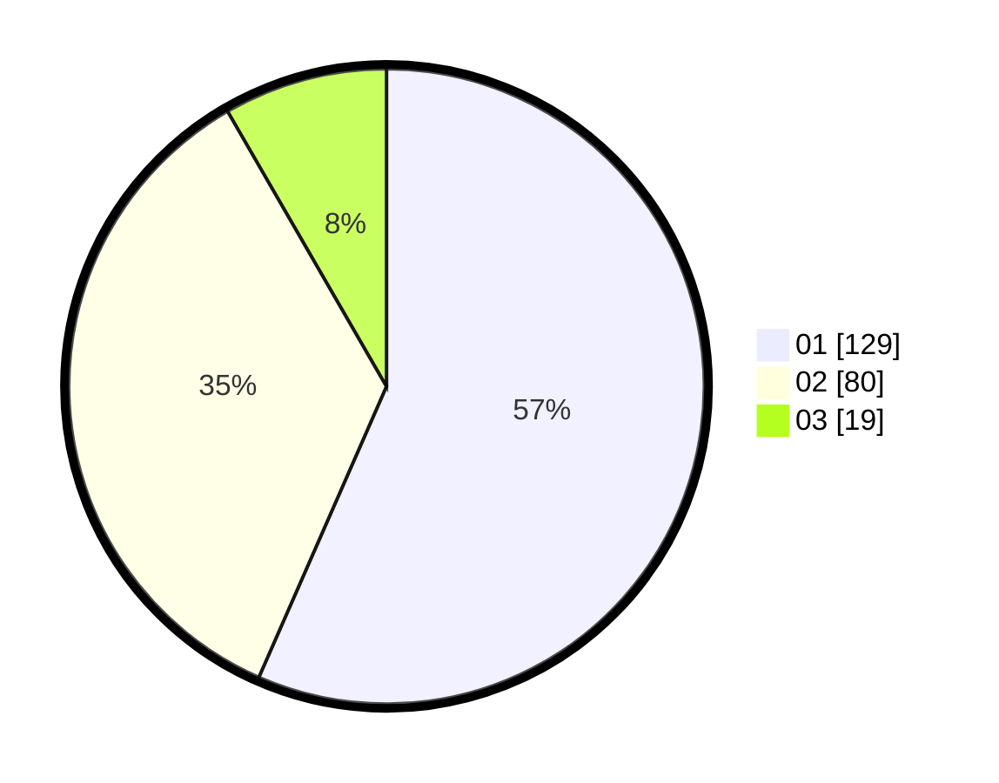

# Hasil

Hasil perolehan suara paslon dapat dilihat pada file paslon-01.txt, paslon-02.txt, dan paslon-03.txt.

Jika tidak ada, artinya data tersebut belum ada pada SIREKAP.

## Perolehan Suara

 * Paslon 01: **129**.
 * Paslon 02: **80**.
 * Paslon 03: **19**.

## Foto C Plano

https://sirekap-obj-formc.kpu.go.id/9738/pemilu/ppwp/31/71/05/10/01/3171051001035-20240215-050031--8ff9b324-1a88-4df6-8a7b-7ccb8e27597a.jpg

https://sirekap-obj-formc.kpu.go.id/9738/pemilu/ppwp/31/71/05/10/01/3171051001035-20240214-235135--740c9c52-5b41-4b08-9ef6-29e6c79e3f1c.jpg

https://sirekap-obj-formc.kpu.go.id/9738/pemilu/ppwp/31/71/05/10/01/3171051001035-20240214-235506--1b366984-3b8a-4068-b826-3c241fa449ba.jpg

## DATA PEMILIH TETAP

Jumlah pemilih dalam DPT: **278**.
 * L: **141**.
 * P: **137**.

## DATA PENGGUNA HAK PILIH

Jumlah pengguna hak pilih dalam DPT: **224**.
 * L: **112**.
 * P: **112**.

Jumlah pengguna hak pilih dalam DPTb: **0**.
 * L: **0**.
 * P: **0**.

Jumlah pengguna hak pilih dalam DPK: **8**.
 * L: **5**.
 * P: **3**.

Jumlah pengguna hak pilih: **232**.
 * L: **117**.
 * P: **115**.

## JUMLAH SUARA SAH DAN TIDAK SAH

JUMLAH SELURUH SUARA SAH: **228**.

JUMLAH SUARA TIDAK SAH: **4**.

JUMLAH SELURUH SUARA SAH DAN SUARA TIDAK SAH: **232**.
