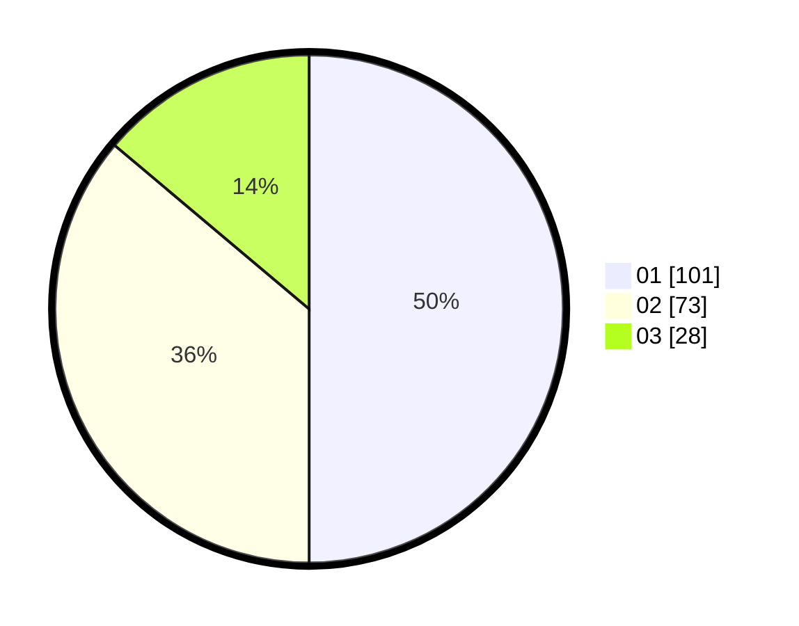

# Hasil

Hasil perolehan suara paslon dapat dilihat pada file paslon-01.txt, paslon-02.txt, dan paslon-03.txt.

Jika tidak ada, artinya data tersebut belum ada pada SIREKAP.

## Perolehan Suara

 * Paslon 01: **101**.
 * Paslon 02: **73**.
 * Paslon 03: **28**.

## Foto C Plano

https://sirekap-obj-formc.kpu.go.id/dd25/pemilu/ppwp/31/71/05/10/01/3171051001036-20240215-233939--5d1b786b-4327-464e-86d6-ceb2c4e973d4.jpg

https://sirekap-obj-formc.kpu.go.id/dd25/pemilu/ppwp/31/71/05/10/01/3171051001036-20240215-233945--e6098c5f-6abc-4532-ad0a-387b9a23337c.jpg

https://sirekap-obj-formc.kpu.go.id/dd25/pemilu/ppwp/31/71/05/10/01/3171051001036-20240215-233942--5bd8f59a-ede0-4929-894f-610a39cc798a.jpg

## DATA PEMILIH TETAP

Jumlah pemilih dalam DPT: **272**.
 * L: **128**.
 * P: **144**.

## DATA PENGGUNA HAK PILIH

Jumlah pengguna hak pilih dalam DPT: **191**.
 * L: **82**.
 * P: **109**.

Jumlah pengguna hak pilih dalam DPTb: **0**.
 * L: **0**.
 * P: **0**.

Jumlah pengguna hak pilih dalam DPK: **16**.
 * L: **9**.
 * P: **7**.

Jumlah pengguna hak pilih: **207**.
 * L: **91**.
 * P: **116**.

## JUMLAH SUARA SAH DAN TIDAK SAH

JUMLAH SELURUH SUARA SAH: **202**.

JUMLAH SUARA TIDAK SAH: **5**.

JUMLAH SELURUH SUARA SAH DAN SUARA TIDAK SAH: **207**.
