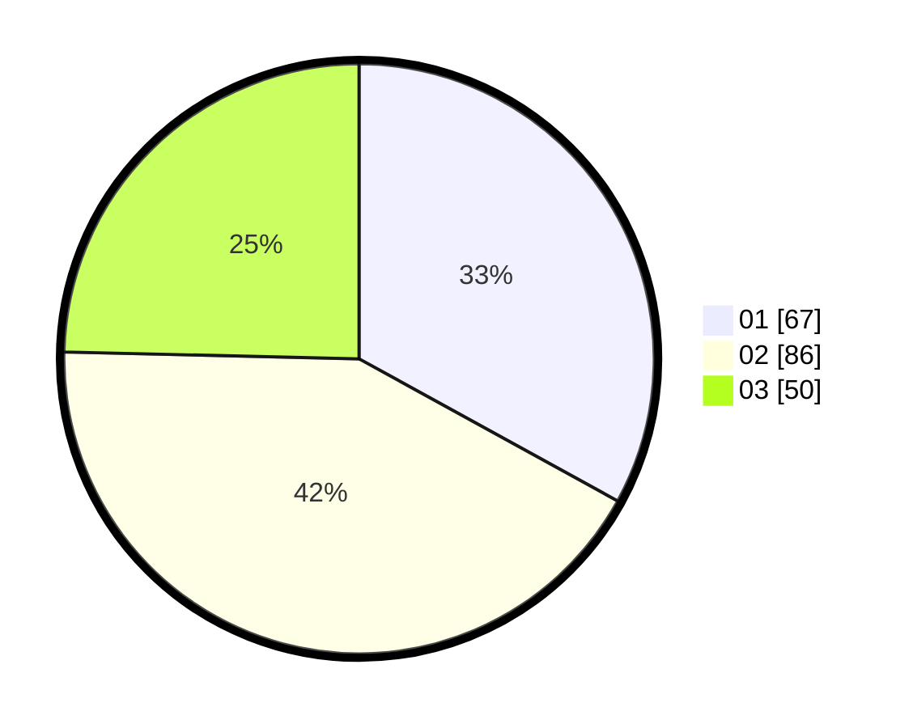

# Hasil

Hasil perolehan suara paslon dapat dilihat pada file paslon-01.txt, paslon-02.txt, dan paslon-03.txt.

Jika tidak ada, artinya data tersebut belum ada pada SIREKAP.

## Perolehan Suara

 * Paslon 01: **67**.
 * Paslon 02: **86**.
 * Paslon 03: **50**.

## Foto C Plano

https://sirekap-obj-formc.kpu.go.id/f55b/pemilu/ppwp/31/71/05/10/01/3171051001038-20240214-155336--681adf10-3d6f-4974-ba4a-9312dc1a4e3e.jpg

https://sirekap-obj-formc.kpu.go.id/f55b/pemilu/ppwp/31/71/05/10/01/3171051001038-20240214-155512--1ece56ea-33ea-48a3-a76a-c482935b190f.jpg

https://sirekap-obj-formc.kpu.go.id/f55b/pemilu/ppwp/31/71/05/10/01/3171051001038-20240214-155549--3fdec38a-bc59-4d4d-9b38-76eef16d57ea.jpg

## DATA PEMILIH TETAP

Jumlah pemilih dalam DPT: **207**.
 * L: **95**.
 * P: **112**.

## DATA PENGGUNA HAK PILIH

Jumlah pengguna hak pilih dalam DPT: **205**.
 * L: **95**.
 * P: **110**.

Jumlah pengguna hak pilih dalam DPTb: **0**.
 * L: **0**.
 * P: **0**.

Jumlah pengguna hak pilih dalam DPK: **2**.
 * L: **0**.
 * P: **2**.

Jumlah pengguna hak pilih: **207**.
 * L: **95**.
 * P: **112**.

## JUMLAH SUARA SAH DAN TIDAK SAH

JUMLAH SELURUH SUARA SAH: **203**.

JUMLAH SUARA TIDAK SAH: **4**.

JUMLAH SELURUH SUARA SAH DAN SUARA TIDAK SAH: **207**.
