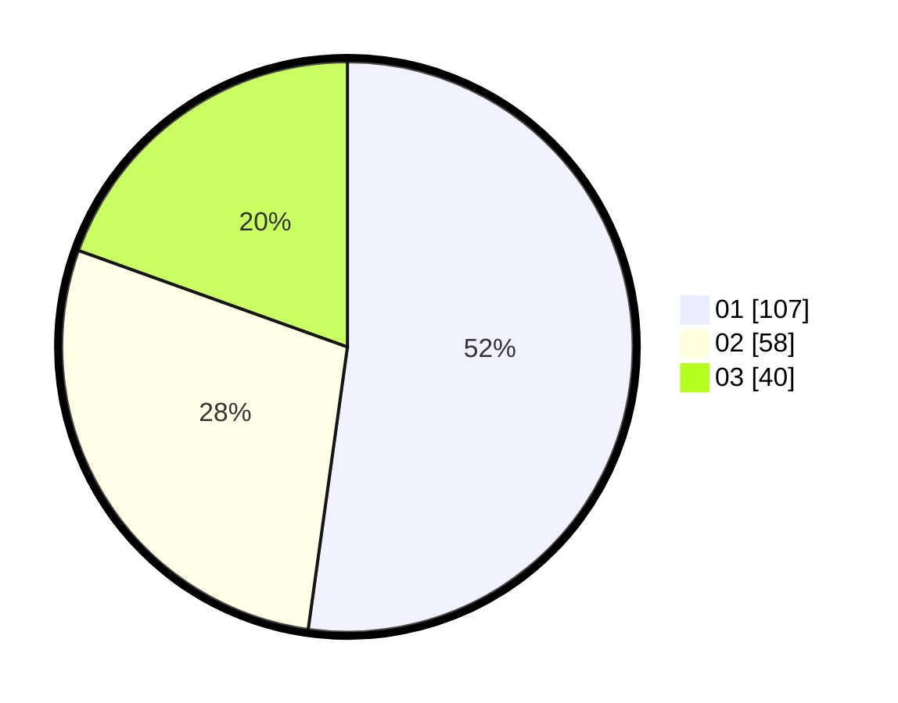

# Hasil

Hasil perolehan suara paslon dapat dilihat pada file paslon-01.txt, paslon-02.txt, dan paslon-03.txt.

Jika tidak ada, artinya data tersebut belum ada pada SIREKAP.

## Perolehan Suara

 * Paslon 01: **107**.
 * Paslon 02: **58**.
 * Paslon 03: **40**.

## Foto C Plano

https://sirekap-obj-formc.kpu.go.id/a2f5/pemilu/ppwp/31/71/05/10/01/3171051001039-20240216-034641--8a2479d8-dd02-4078-8acf-3b9afef8ccfd.jpg

https://sirekap-obj-formc.kpu.go.id/a2f5/pemilu/ppwp/31/71/05/10/01/3171051001039-20240216-034642--465de889-cece-40fa-bc10-20b90fbcbc4d.jpg

https://sirekap-obj-formc.kpu.go.id/a2f5/pemilu/ppwp/31/71/05/10/01/3171051001039-20240216-034642--107154fc-614c-453c-9967-6e4c82c4b081.jpg

## DATA PEMILIH TETAP

Jumlah pemilih dalam DPT: **272**.
 * L: **135**.
 * P: **137**.

## DATA PENGGUNA HAK PILIH

Jumlah pengguna hak pilih dalam DPT: **207**.
 * L: **91**.
 * P: **116**.

Jumlah pengguna hak pilih dalam DPTb: **0**.
 * L: **0**.
 * P: **0**.

Jumlah pengguna hak pilih dalam DPK: **0**.
 * L: **0**.
 * P: **0**.

Jumlah pengguna hak pilih: **207**.
 * L: **91**.
 * P: **116**.

## JUMLAH SUARA SAH DAN TIDAK SAH

JUMLAH SELURUH SUARA SAH: **205**.

JUMLAH SUARA TIDAK SAH: **2**.

JUMLAH SELURUH SUARA SAH DAN SUARA TIDAK SAH: **207**.
