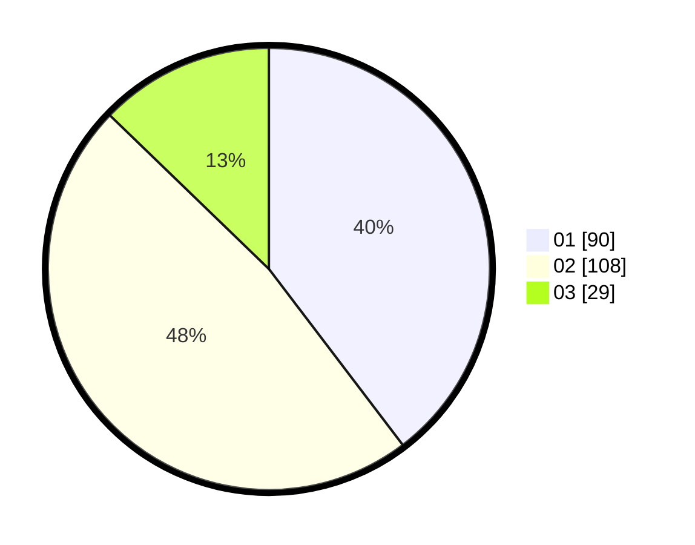

# Hasil

Hasil perolehan suara paslon dapat dilihat pada file paslon-01.txt, paslon-02.txt, dan paslon-03.txt.

Jika tidak ada, artinya data tersebut belum ada pada SIREKAP.

## Perolehan Suara

 * Paslon 01: **90**.
 * Paslon 02: **108**.
 * Paslon 03: **29**.

## Foto C Plano

https://sirekap-obj-formc.kpu.go.id/baf0/pemilu/ppwp/31/71/05/10/01/3171051001044-20240216-003537--f67a454f-3fa3-48a4-8744-a827f92d7bcc.jpg

https://sirekap-obj-formc.kpu.go.id/baf0/pemilu/ppwp/31/71/05/10/01/3171051001044-20240216-003540--971496ca-23a6-4a95-bdf3-62f8808c6b55.jpg

https://sirekap-obj-formc.kpu.go.id/baf0/pemilu/ppwp/31/71/05/10/01/3171051001044-20240216-003538--5d7ada51-c6aa-42aa-91c8-6875d726b238.jpg

## DATA PEMILIH TETAP

Jumlah pemilih dalam DPT: **284**.
 * L: **133**.
 * P: **151**.

## DATA PENGGUNA HAK PILIH

Jumlah pengguna hak pilih dalam DPT: **232**.
 * L: **110**.
 * P: **122**.

Jumlah pengguna hak pilih dalam DPTb: **0**.
 * L: **0**.
 * P: **0**.

Jumlah pengguna hak pilih dalam DPK: **2**.
 * L: **1**.
 * P: **1**.

Jumlah pengguna hak pilih: **234**.
 * L: **111**.
 * P: **123**.

## JUMLAH SUARA SAH DAN TIDAK SAH

JUMLAH SELURUH SUARA SAH: **227**.

JUMLAH SUARA TIDAK SAH: **7**.

JUMLAH SELURUH SUARA SAH DAN SUARA TIDAK SAH: **234**.
