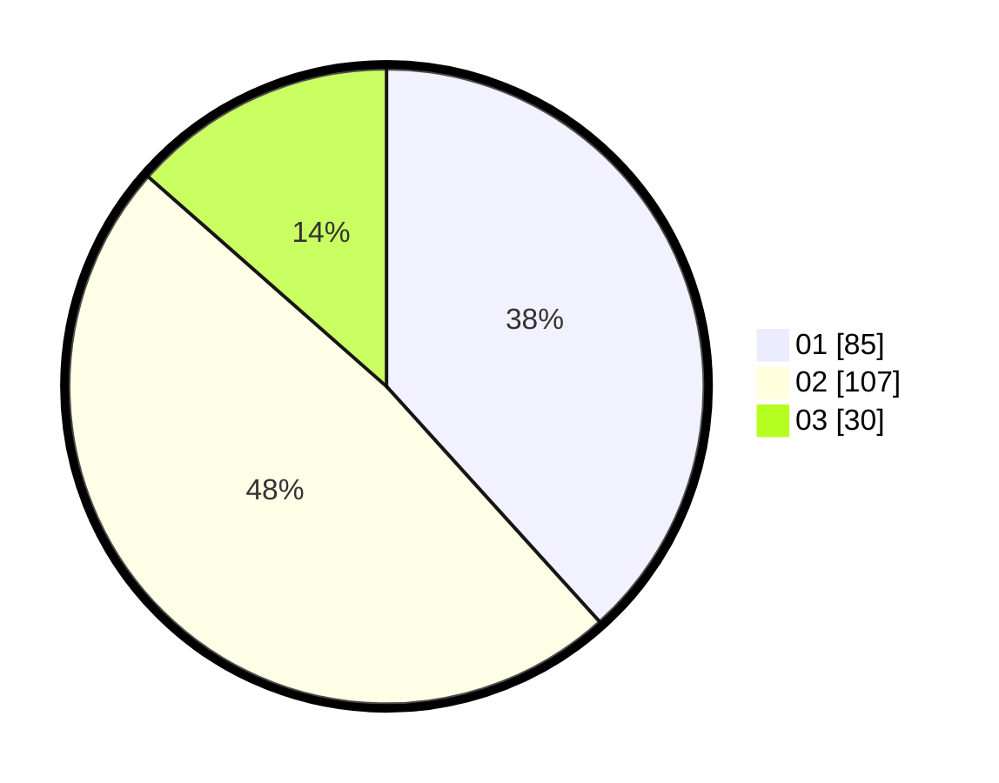

# Hasil

Hasil perolehan suara paslon dapat dilihat pada file paslon-01.txt, paslon-02.txt, dan paslon-03.txt.

Jika tidak ada, artinya data tersebut belum ada pada SIREKAP.

## Perolehan Suara

 * Paslon 01: **85**.
 * Paslon 02: **107**.
 * Paslon 03: **30**.

## Foto C Plano

https://sirekap-obj-formc.kpu.go.id/dc2b/pemilu/ppwp/31/71/05/10/01/3171051001048-20240215-214900--fa16ec16-c79e-4397-8b3f-5fbe085ec229.jpg

https://sirekap-obj-formc.kpu.go.id/dc2b/pemilu/ppwp/31/71/05/10/01/3171051001048-20240215-214903--0297d282-8fe3-4284-bc13-a9b607e6c945.jpg

https://sirekap-obj-formc.kpu.go.id/dc2b/pemilu/ppwp/31/71/05/10/01/3171051001048-20240215-214902--d891ef53-1e29-4814-b4d7-4ca93c1bbabe.jpg

## DATA PEMILIH TETAP

Jumlah pemilih dalam DPT: **275**.
 * L: **139**.
 * P: **136**.

## DATA PENGGUNA HAK PILIH

Jumlah pengguna hak pilih dalam DPT: **224**.
 * L: **105**.
 * P: **119**.

Jumlah pengguna hak pilih dalam DPTb: **1**.
 * L: **1**.
 * P: **0**.

Jumlah pengguna hak pilih dalam DPK: **0**.
 * L: **0**.
 * P: **0**.

Jumlah pengguna hak pilih: **225**.
 * L: **106**.
 * P: **119**.

## JUMLAH SUARA SAH DAN TIDAK SAH

JUMLAH SELURUH SUARA SAH: **222**.

JUMLAH SUARA TIDAK SAH: **3**.

JUMLAH SELURUH SUARA SAH DAN SUARA TIDAK SAH: **225**.
