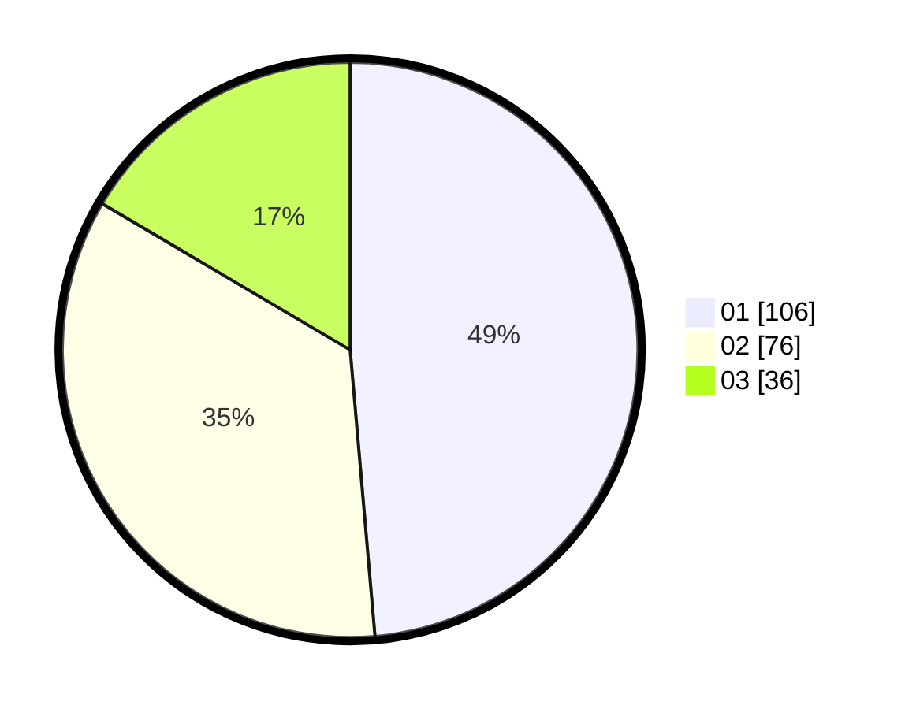

# Hasil

Hasil perolehan suara paslon dapat dilihat pada file paslon-01.txt, paslon-02.txt, dan paslon-03.txt.

Jika tidak ada, artinya data tersebut belum ada pada SIREKAP.

## Perolehan Suara

 * Paslon 01: **106**.
 * Paslon 02: **76**.
 * Paslon 03: **36**.

## Foto C Plano

https://sirekap-obj-formc.kpu.go.id/6250/pemilu/ppwp/31/71/05/10/01/3171051001050-20240216-084941--644472a2-f048-4385-91c8-7a3333caf566.jpg

https://sirekap-obj-formc.kpu.go.id/6250/pemilu/ppwp/31/71/05/10/01/3171051001050-20240216-084943--4885868b-a953-42df-ad7d-9704d9016c4a.jpg

https://sirekap-obj-formc.kpu.go.id/6250/pemilu/ppwp/31/71/05/10/01/3171051001050-20240216-084942--0f265965-55ee-42a5-ac16-76d4a8919575.jpg

## DATA PEMILIH TETAP

Jumlah pemilih dalam DPT: **272**.
 * L: **128**.
 * P: **144**.

## DATA PENGGUNA HAK PILIH

Jumlah pengguna hak pilih dalam DPT: **206**.
 * L: **96**.
 * P: **110**.

Jumlah pengguna hak pilih dalam DPTb: **4**.
 * L: **1**.
 * P: **3**.

Jumlah pengguna hak pilih dalam DPK: **10**.
 * L: **4**.
 * P: **6**.

Jumlah pengguna hak pilih: **220**.
 * L: **101**.
 * P: **119**.

## JUMLAH SUARA SAH DAN TIDAK SAH

JUMLAH SELURUH SUARA SAH: **218**.

JUMLAH SUARA TIDAK SAH: **2**.

JUMLAH SELURUH SUARA SAH DAN SUARA TIDAK SAH: **220**.
