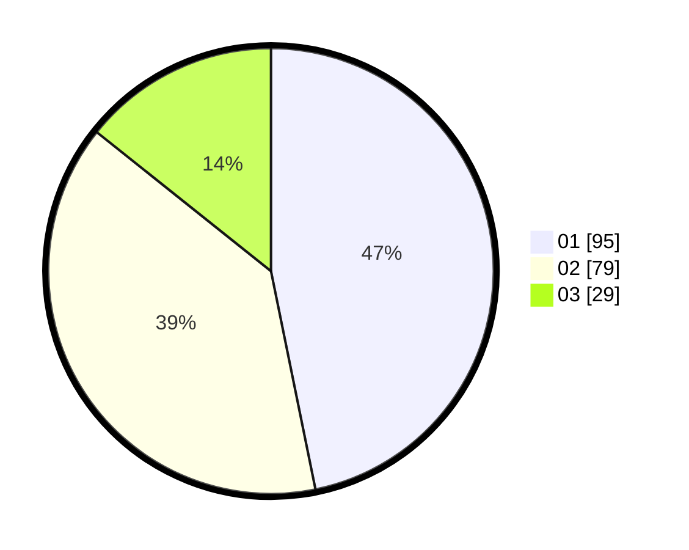

# Hasil

Hasil perolehan suara paslon dapat dilihat pada file paslon-01.txt, paslon-02.txt, dan paslon-03.txt.

Jika tidak ada, artinya data tersebut belum ada pada SIREKAP.

## Perolehan Suara

 * Paslon 01: **95**.
 * Paslon 02: **79**.
 * Paslon 03: **29**.

## Foto C Plano

https://sirekap-obj-formc.kpu.go.id/7ed3/pemilu/ppwp/31/71/05/10/01/3171051001052-20240214-231607--0e95203b-7517-4f50-a6f5-b2ae36f78a82.jpg

https://sirekap-obj-formc.kpu.go.id/7ed3/pemilu/ppwp/31/71/05/10/01/3171051001052-20240215-163252--8c95e636-d370-4f8f-ae47-1d91192ead97.jpg

https://sirekap-obj-formc.kpu.go.id/7ed3/pemilu/ppwp/31/71/05/10/01/3171051001052-20240214-231824--43d1ed55-7680-4651-bf9b-ec0ba5e47f6b.jpg

## DATA PEMILIH TETAP

Jumlah pemilih dalam DPT: **195**.
 * L: **95**.
 * P: **100**.

## DATA PENGGUNA HAK PILIH

Jumlah pengguna hak pilih dalam DPT: **195**.
 * L: **95**.
 * P: **100**.

Jumlah pengguna hak pilih dalam DPTb: **5**.
 * L: **2**.
 * P: **3**.

Jumlah pengguna hak pilih dalam DPK: **6**.
 * L: **1**.
 * P: **5**.

Jumlah pengguna hak pilih: **206**.
 * L: **98**.
 * P: **108**.

## JUMLAH SUARA SAH DAN TIDAK SAH

JUMLAH SELURUH SUARA SAH: **203**.

JUMLAH SUARA TIDAK SAH: **3**.

JUMLAH SELURUH SUARA SAH DAN SUARA TIDAK SAH: **206**.
