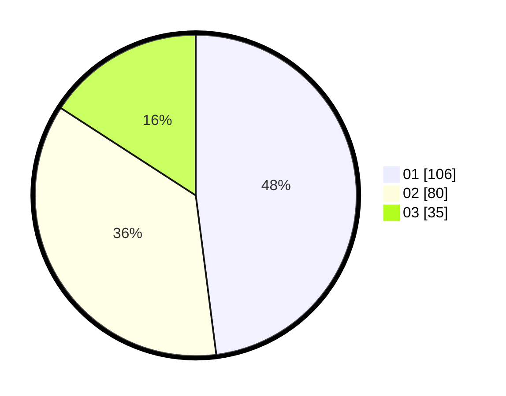

# Hasil

Hasil perolehan suara paslon dapat dilihat pada file paslon-01.txt, paslon-02.txt, dan paslon-03.txt.

Jika tidak ada, artinya data tersebut belum ada pada SIREKAP.

## Perolehan Suara

 * Paslon 01: **106**.
 * Paslon 02: **80**.
 * Paslon 03: **35**.

## Foto C Plano

https://sirekap-obj-formc.kpu.go.id/a7c4/pemilu/ppwp/31/71/05/10/01/3171051001057-20240216-123716--4340d3e8-88af-40f6-9328-781de71c2f12.jpg

https://sirekap-obj-formc.kpu.go.id/a7c4/pemilu/ppwp/31/71/05/10/01/3171051001057-20240216-123719--543e9a95-170e-44e5-ac96-38b38077c53c.jpg

https://sirekap-obj-formc.kpu.go.id/a7c4/pemilu/ppwp/31/71/05/10/01/3171051001057-20240216-123717--4c239999-1907-438a-a0ec-b28f72e51d45.jpg

## DATA PEMILIH TETAP

Jumlah pemilih dalam DPT: **281**.
 * L: **143**.
 * P: **138**.

## DATA PENGGUNA HAK PILIH

Jumlah pengguna hak pilih dalam DPT: **213**.
 * L: **103**.
 * P: **110**.

Jumlah pengguna hak pilih dalam DPTb: **4**.
 * L: **1**.
 * P: **3**.

Jumlah pengguna hak pilih dalam DPK: **6**.
 * L: **2**.
 * P: **4**.

Jumlah pengguna hak pilih: **223**.
 * L: **106**.
 * P: **117**.

## JUMLAH SUARA SAH DAN TIDAK SAH

JUMLAH SELURUH SUARA SAH: **221**.

JUMLAH SUARA TIDAK SAH: **2**.

JUMLAH SELURUH SUARA SAH DAN SUARA TIDAK SAH: **223**.
