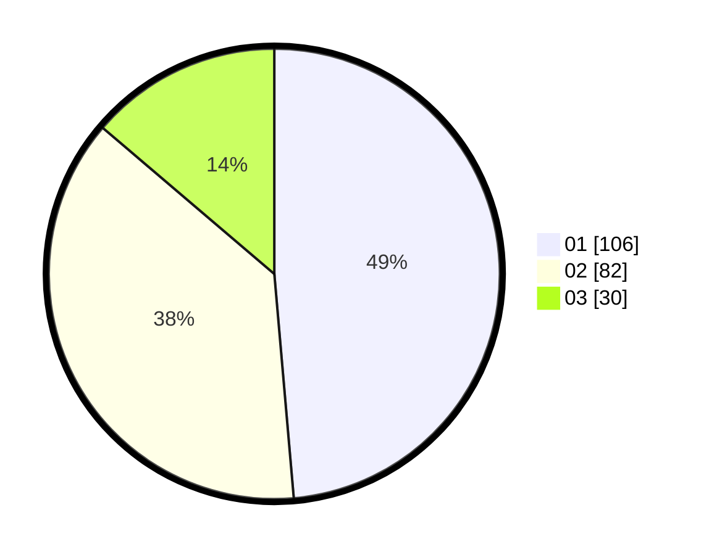

# Hasil

Hasil perolehan suara paslon dapat dilihat pada file paslon-01.txt, paslon-02.txt, dan paslon-03.txt.

Jika tidak ada, artinya data tersebut belum ada pada SIREKAP.

## Perolehan Suara

 * Paslon 01: **106**.
 * Paslon 02: **82**.
 * Paslon 03: **30**.

## Foto C Plano

https://sirekap-obj-formc.kpu.go.id/2f3b/pemilu/ppwp/31/71/05/10/01/3171051001058-20240214-195334--0a2db04a-b6ad-4e01-a9de-ff31948714ac.jpg

https://sirekap-obj-formc.kpu.go.id/2f3b/pemilu/ppwp/31/71/05/10/01/3171051001058-20240214-195626--d3e99274-be3a-48a6-90ce-60268fc68253.jpg

https://sirekap-obj-formc.kpu.go.id/2f3b/pemilu/ppwp/31/71/05/10/01/3171051001058-20240214-195804--d1f8fafd-86cf-4410-8cef-10d5215c3502.jpg

## DATA PEMILIH TETAP

Jumlah pemilih dalam DPT: **279**.
 * L: **129**.
 * P: **150**.

## DATA PENGGUNA HAK PILIH

Jumlah pengguna hak pilih dalam DPT: **201**.
 * L: **94**.
 * P: **107**.

Jumlah pengguna hak pilih dalam DPTb: **6**.
 * L: **1**.
 * P: **5**.

Jumlah pengguna hak pilih dalam DPK: **2**.
 * L: **1**.
 * P: **1**.

Jumlah pengguna hak pilih: **209**.
 * L: **96**.
 * P: **113**.

## JUMLAH SUARA SAH DAN TIDAK SAH

JUMLAH SELURUH SUARA SAH: **218**.

JUMLAH SUARA TIDAK SAH: **1**.

JUMLAH SELURUH SUARA SAH DAN SUARA TIDAK SAH: **219**.
