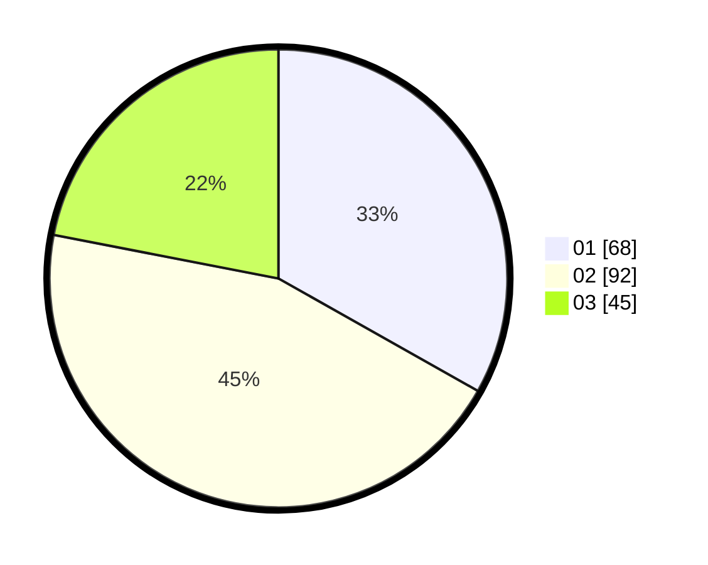

# Hasil

Hasil perolehan suara paslon dapat dilihat pada file paslon-01.txt, paslon-02.txt, dan paslon-03.txt.

Jika tidak ada, artinya data tersebut belum ada pada SIREKAP.

## Perolehan Suara

 * Paslon 01: **68**.
 * Paslon 02: **92**.
 * Paslon 03: **45**.

## Foto C Plano

https://sirekap-obj-formc.kpu.go.id/995d/pemilu/ppwp/31/71/05/10/01/3171051001059-20240216-065540--224554b5-3692-4d7d-84fd-f15f2df34ac7.jpg

https://sirekap-obj-formc.kpu.go.id/995d/pemilu/ppwp/31/71/05/10/01/3171051001059-20240216-065543--5392e2cb-166b-4572-939f-acfd63d11e54.jpg

https://sirekap-obj-formc.kpu.go.id/995d/pemilu/ppwp/31/71/05/10/01/3171051001059-20240216-065541--be38040a-8bf6-4049-a8e4-d2d9298a0b46.jpg

## DATA PEMILIH TETAP

Jumlah pemilih dalam DPT: **274**.
 * L: **140**.
 * P: **134**.

## DATA PENGGUNA HAK PILIH

Jumlah pengguna hak pilih dalam DPT: **206**.
 * L: **99**.
 * P: **107**.

Jumlah pengguna hak pilih dalam DPTb: **3**.
 * L: **2**.
 * P: **1**.

Jumlah pengguna hak pilih dalam DPK: **0**.
 * L: **0**.
 * P: **0**.

Jumlah pengguna hak pilih: **209**.
 * L: **101**.
 * P: **108**.

## JUMLAH SUARA SAH DAN TIDAK SAH

JUMLAH SELURUH SUARA SAH: **205**.

JUMLAH SUARA TIDAK SAH: **4**.

JUMLAH SELURUH SUARA SAH DAN SUARA TIDAK SAH: **209**.
