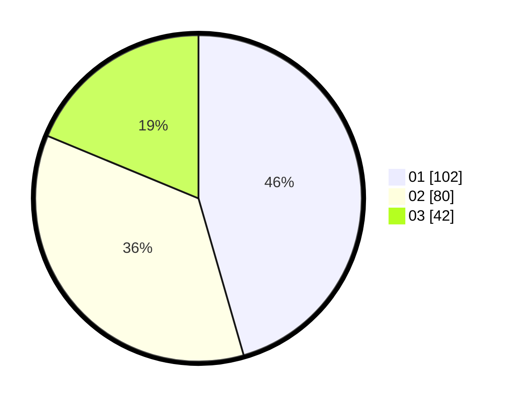

# Hasil

Hasil perolehan suara paslon dapat dilihat pada file paslon-01.txt, paslon-02.txt, dan paslon-03.txt.

Jika tidak ada, artinya data tersebut belum ada pada SIREKAP.

## Perolehan Suara

 * Paslon 01: **102**.
 * Paslon 02: **80**.
 * Paslon 03: **42**.

## Foto C Plano

https://sirekap-obj-formc.kpu.go.id/771b/pemilu/ppwp/31/71/05/10/01/3171051001060-20240216-072649--3a467114-fb10-4669-afb8-2e0e5a9f0008.jpg

https://sirekap-obj-formc.kpu.go.id/771b/pemilu/ppwp/31/71/05/10/01/3171051001060-20240216-072652--9fc3cf19-7d56-4b10-a914-2c2228b42b05.jpg

https://sirekap-obj-formc.kpu.go.id/771b/pemilu/ppwp/31/71/05/10/01/3171051001060-20240216-072650--1ed6b9f5-572b-47f9-801b-bbc4b0a4faee.jpg

## DATA PEMILIH TETAP

Jumlah pemilih dalam DPT: **246**.
 * L: **110**.
 * P: **136**.

## DATA PENGGUNA HAK PILIH

Jumlah pengguna hak pilih dalam DPT: **198**.
 * L: **91**.
 * P: **107**.

Jumlah pengguna hak pilih dalam DPTb: **20**.
 * L: **10**.
 * P: **10**.

Jumlah pengguna hak pilih dalam DPK: **7**.
 * L: **2**.
 * P: **5**.

Jumlah pengguna hak pilih: **225**.
 * L: **103**.
 * P: **122**.

## JUMLAH SUARA SAH DAN TIDAK SAH

JUMLAH SELURUH SUARA SAH: **224**.

JUMLAH SUARA TIDAK SAH: **1**.

JUMLAH SELURUH SUARA SAH DAN SUARA TIDAK SAH: **225**.
