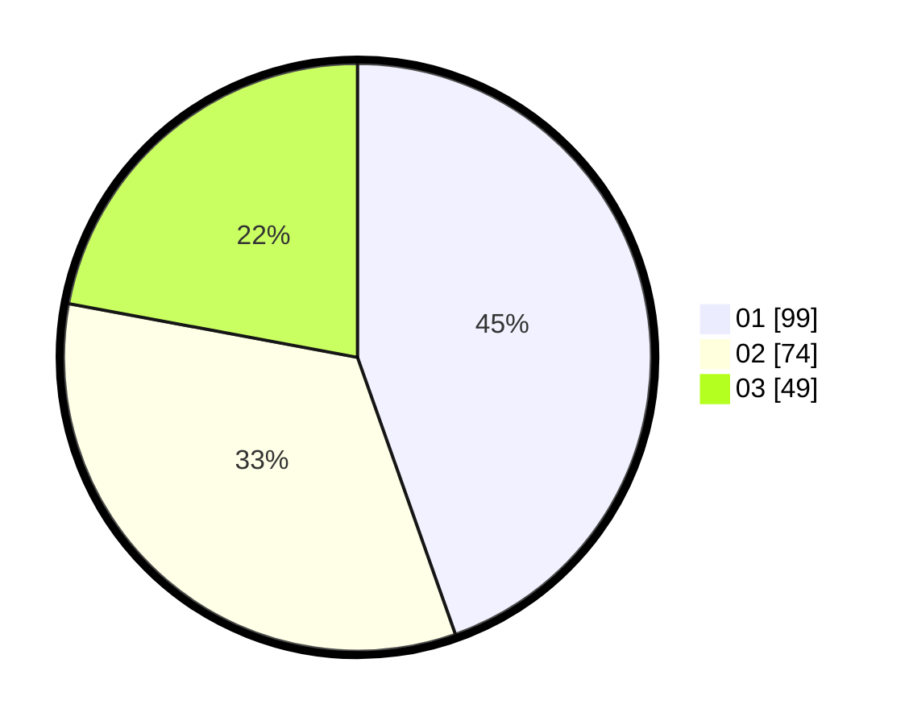

# Hasil

Hasil perolehan suara paslon dapat dilihat pada file paslon-01.txt, paslon-02.txt, dan paslon-03.txt.

Jika tidak ada, artinya data tersebut belum ada pada SIREKAP.

## Perolehan Suara

 * Paslon 01: **99**.
 * Paslon 02: **74**.
 * Paslon 03: **49**.

## Foto C Plano

https://sirekap-obj-formc.kpu.go.id/0a61/pemilu/ppwp/31/71/05/10/01/3171051001061-20240216-043830--4c4995b7-3dc5-4b46-8fe4-43c37db29f79.jpg

https://sirekap-obj-formc.kpu.go.id/0a61/pemilu/ppwp/31/71/05/10/01/3171051001061-20240216-043831--e339b00c-2baa-4245-b6b3-a1eba44de629.jpg

https://sirekap-obj-formc.kpu.go.id/0a61/pemilu/ppwp/31/71/05/10/01/3171051001061-20240216-043830--de0293ec-bdda-4404-bfc9-ef8f8ada4bfa.jpg

## DATA PEMILIH TETAP

Jumlah pemilih dalam DPT: **252**.
 * L: **121**.
 * P: **131**.

## DATA PENGGUNA HAK PILIH

Jumlah pengguna hak pilih dalam DPT: **199**.
 * L: **99**.
 * P: **100**.

Jumlah pengguna hak pilih dalam DPTb: **23**.
 * L: **12**.
 * P: **11**.

Jumlah pengguna hak pilih dalam DPK: **5**.
 * L: **2**.
 * P: **3**.

Jumlah pengguna hak pilih: **227**.
 * L: **113**.
 * P: **114**.

## JUMLAH SUARA SAH DAN TIDAK SAH

JUMLAH SELURUH SUARA SAH: **222**.

JUMLAH SUARA TIDAK SAH: **5**.

JUMLAH SELURUH SUARA SAH DAN SUARA TIDAK SAH: **227**.
