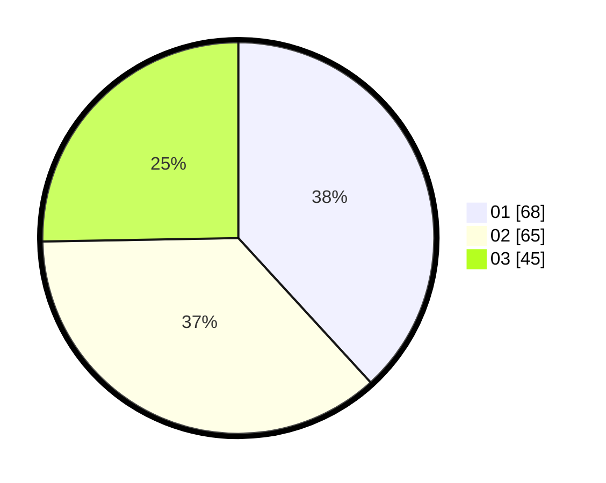

# Hasil

Hasil perolehan suara paslon dapat dilihat pada file paslon-01.txt, paslon-02.txt, dan paslon-03.txt.

Jika tidak ada, artinya data tersebut belum ada pada SIREKAP.

## Perolehan Suara

 * Paslon 01: **68**.
 * Paslon 02: **65**.
 * Paslon 03: **45**.

## Foto C Plano

https://sirekap-obj-formc.kpu.go.id/1f01/pemilu/ppwp/31/71/05/10/01/3171051001062-20240216-130904--d334b665-77d5-411e-86bd-1c7aa7cb84b6.jpg

https://sirekap-obj-formc.kpu.go.id/1f01/pemilu/ppwp/31/71/05/10/01/3171051001062-20240216-130906--9b400fd1-2985-40d4-a00f-fd493b636134.jpg

https://sirekap-obj-formc.kpu.go.id/1f01/pemilu/ppwp/31/71/05/10/01/3171051001062-20240216-130905--584c1dab-8376-41a1-920a-6527991549b8.jpg

## DATA PEMILIH TETAP

Jumlah pemilih dalam DPT: **245**.
 * L: **127**.
 * P: **118**.

## DATA PENGGUNA HAK PILIH

Jumlah pengguna hak pilih dalam DPT: **153**.
 * L: **81**.
 * P: **72**.

Jumlah pengguna hak pilih dalam DPTb: **24**.
 * L: **6**.
 * P: **18**.

Jumlah pengguna hak pilih dalam DPK: **1**.
 * L: **0**.
 * P: **1**.

Jumlah pengguna hak pilih: **178**.
 * L: **87**.
 * P: **91**.

## JUMLAH SUARA SAH DAN TIDAK SAH

JUMLAH SELURUH SUARA SAH: **178**.

JUMLAH SUARA TIDAK SAH: **0**.

JUMLAH SELURUH SUARA SAH DAN SUARA TIDAK SAH: **178**.
